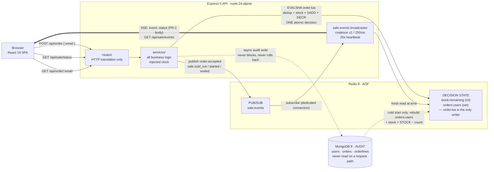

# Flash Sale System

100 units. 5,000 buyers. One noon. Nobody gets a unit that doesn't exist, nobody
who ordered is ever told they didn't, and the page tells the truth the whole way
through.

An Express 5 API with a Redis concurrency core and a MongoDB audit trail, plus a
React 19 single-page storefront — in an npm-workspaces monorepo, started with one
command and provable with one more.

## Quick start

```bash
docker compose up      # healthchecked redis + mongo, then the api on :3000
```

Open <http://localhost:3000>. The compose defaults ship an **already-active**
sale (window `2026-01-01T00:00:00Z` → `2027-01-01T00:00:00Z`, 100 units), so the
page is live the moment the stack is up. Override the window and stock with a
`.env` file next to `docker-compose.yml` (see [Configuration](#configuration)).

## Architecture



The two dashed edges carry the design's most important claims: the Mongo write
is **asynchronous and never reverses a decision**, and Mongo rebuilds Redis
**only on a cold start** — never during a sale, never the other way round.

## How it stays fair

### One Lua script is the whole decision

The dedup check, the stock check, the `SADD` and the `DECR` run **server-side in
Redis as a single atomic unit** (`server/src/adapters/redis/order.lua`, invoked
by `EVALSHA` with a `NOSCRIPT` fallback). It returns exactly one of `OK`,
`ALREADY`, `SOLD_OUT` plus the remaining stock.

- **Prevents:** the read-then-write race that sells the 101st unit; the
  compensation windows that hand a user a lying "already ordered" after a
  rollback. While the API serves, this script is the *only* writer of the sale
  state — there is no app-side sequence of Redis commands, and no in-process
  lock anywhere in the hot path.
- **Costs:** the most important logic in the system is written in Lua, not
  TypeScript, and is tested through Redis rather than through the type checker.

### Redis decides, MongoDB records

Every runtime read — sale status, stock, the idempotency check — hits **Redis
only**. MongoDB is written *after* the script accepts, asynchronously, and is
never read on a request path.

- **Prevents:** mixed-source reads, and the false `ordered: false` window that a
  Mongo-backed check would return in the milliseconds after a 201.
- **Costs:** a crash between the Redis accept and the Mongo write loses the
  **audit row** permanently. The buyer keeps their order (Redis is correct); the
  audit under-counts. See [Limitations](#limitations--future-work).

### Fail closed on Redis loss

Any request whose answer needs Redis returns **503** when Redis is unreachable —
and a command timeout counts as unreachable. Open SSE streams are closed; new
ones are refused. There is no fallback store, ever.

- **Prevents:** fail-open overselling. Serving stale stock from memory or Mongo
  under a Redis blip is the one way to break the only invariant that matters.
- **Costs:** availability is traded for correctness. A Redis outage is a full
  outage, by choice.

### Synchronous order flow — no queue

Click → decision → verdict, inside one request/response cycle. No queue, no
worker, no "pending" state, no reservation.

- **Prevents:** queue-position theatre and outcomes nobody can interpret.
  `GET /api/order/:email` exists for reassurance, never to *learn* an outcome.
- **Costs:** no shock absorber under a burst — the API takes the full 5,000
  concurrent attempts on the chin. Which is precisely what the stress test
  exists to check.

### The email is the idempotency key

A repeat `POST /api/order` from someone who already holds an order returns the
**same success** (`200`), never a duplicate and never an error — at any time,
including after the sale ends.

- **Prevents:** the retry-after-timeout trap: a buyer who never saw their 201
  clicks again and is told, honestly, that they already have one.
- **Costs:** emails are trimmed but not canonicalized — `a@x.com` and `A@x.com`
  are two different buyers (see [Limitations](#limitations--future-work)).

## API

Four endpoints. No auth. Every success body carries `success: true`; every error
body carries `success: false` and an `error` string.

### `GET /api/sale/status`

```json
{ "success": true, "status": "active", "stock": 42,
  "startTime": "2026-07-10T04:00:00.000Z", "endTime": "2026-07-10T05:00:00.000Z" }
```

`status` is one of `upcoming` · `active` · `sold_out` · `ended`. It is `active`
only inside `[SALE_START_TIME, SALE_END_TIME)` **and** while stock remains;
`sold_out` inside the window at zero stock. `503` when Redis is unreachable.

### `POST /api/order`

Request: `{ "email": "you@example.com" }` (trimmed; empty or > 256 chars is a 400).

| Situation | Status | Body |
| --- | --- | --- |
| New email, sale active, stock left | `201` | `{ "success": true, "email": "…", "message": "Order successful." }` |
| This email already holds an order — **at any time** | `200` | `{ "success": true, "email": "…", "message": "You have already ordered this item." }` |
| Stock is zero, no prior order | `409` | `{ "success": false, "error": "Item is sold out." }` |
| Outside the sale window, no prior order | `409` | `{ "success": false, "error": "Sale is not active." }` |
| Missing / empty / oversized email | `400` | `{ "success": false, "error": "Email is required." }` |
| Redis unreachable | `503` | `{ "success": false, "error": "Service temporarily unavailable." }` |

**Precedence, and the one thing evaluators mis-read as a bug:** checks resolve in
the order *validation (400) → already-ordered (200) → window (409) → stock (409)
→ created (201)*. An order holder **always wins** — a retry an hour after the
sale ended returns `200 "You have already ordered this item."`, not `409`. That
is deliberate (FR-3 governs over FR-2's older wording), and the tests assert it.

The single 409 string `"Sale is not active."` covers both *upcoming* and *ended*
— the API does not distinguish them, and the page renders the difference from
the live sale state it already holds.

### `GET /api/order/:email`

`200 { "success": true, "ordered": true|false, "email": "…" }` — a Redis-only
membership read, never clock-gated, never a way to learn the outcome of an
attempt you just made. `400` on an empty email.

### `GET /api/sale/events` (SSE)

`text/event-stream`. One event type — `status` — whose `data` is exactly the
`GET /api/sale/status` body, composed from a **fresh Redis read at emit time**.
A snapshot frame is sent on every (re)connect (no replay, no `Last-Event-ID`);
updates coalesce to at most one frame per 250 ms, with terminal transitions
(`sold_out`, `ended`) emitted immediately; a `: heartbeat` comment every 25 s.
The stream **closes** if Redis is lost, and a new stream gets a `503`.

## Configuration

Env vars only — parsed and validated **once at boot**, fail-fast. There is no
runtime admin endpoint.

| Variable | Required | Default | Meaning |
| --- | --- | --- | --- |
| `SALE_START_TIME` | **yes** | — | ISO 8601; parsed to UTC epoch ms at boot |
| `SALE_END_TIME` | **yes** | — | ISO 8601; must be strictly after the start |
| `STOCK_QUANTITY` | no | `100` | Positive integer; units on sale |
| `REDIS_URL` | no | `redis://localhost:6379` | Redis 8, AOF enabled |
| `MONGODB_URI` | no | `mongodb://localhost:27017/flash-sale` | The audit database |
| `PORT` | no | `3000` | API port |

An invalid or missing required value fails the boot **before** the server
listens. The sale window is the server's clock alone (UTC) — client clocks are
never consulted.

Compose ships defaults for an active sale; override them in `.env`:

```bash
SALE_START_TIME=2026-07-13T12:00:00Z
SALE_END_TIME=2026-07-13T13:00:00Z
STOCK_QUANTITY=100
```

> Changing `STOCK_QUANTITY` against a Redis that already holds sale state is a
> deliberate **no-op** (a warm start touches nothing). Reset with the harness's
> reset step, or `docker compose down -v`.

## Proving it

The fairness claim is not something to take on faith — run it:

```bash
npm run stress        # or: make stress
```

Prerequisite: Docker. k6 runs from your `PATH` if you have it, otherwise from
the `grafana/k6:2.1` image. The harness executes the protocol in the only order
that is honest:

1. **stop api** — a reset against a serving API would race the Lua script.
2. **reset** (`stress/reset.ts`) — `SET stock:remaining = STOCK_QUANTITY`,
   `DEL orders:users`, `deleteMany` on `orders`/`orderlines`/`users`. It probes
   the API first and refuses to run if anything answers.
3. **start api** — and wait for `GET /api/sale/status` to answer 200, so the
   boot reconcile has finished before the burst lands.
4. **k6** (`stress/k6-order.js`) — 5,000 **unique** emails at `POST /api/order`
   as a concurrent burst. Thresholds fail the run on any 5xx and on any status
   outside `{201, 409}`.
5. **verify** (`stress/verify.ts`) — polls Mongo until the confirmed-order count
   is stable across two 1-second samples (the audit write is async by design),
   then asserts the counts.
6. **window check** — restarts the API with a past sale window and confirms 20/20
   attempts are rejected `409 { "success": false, "error": "Sale is not active." }`.

**What passing looks like:**

```
k6:        201 × 100 · 409 × 4,900 · 5xx × 0
verifier:  confirmed orders == 100 == distinct emails == SCARD orders:users
           stock:remaining == 0
```

Every check is an **equality**. Fewer than 100 successes fails just as loudly as
101: an inflated rejection rate means the system is under-accepting, which is
also a bug. The combined exit code is the pass/fail signal.

Knobs: `ATTEMPTS` (default 5000), `VUS` (default 500 — 5,000 unique *buyers* is
the claim; 5,000 simultaneous OS-level VUs is not), `STOCK_QUANTITY`, `RETRY=1`
(adds an idempotent-retry scenario, where `200` becomes an allowed status), and
`--skip-window`.

> **Honest status:** the harness ships tested (its reset guard, its verifier
> assertions and its k6 traps have unit tests), but **it has not yet been run
> against a live stack in this repository's history** — the development
> environment has no Docker. Your run is the first. The design is built to pass;
> nothing here claims it has.

## Development

```bash
npm install                      # all workspaces, one root lockfile
docker compose up -d redis mongo # stores only (ports 6379 / 27017 are published)
cp .env.example .env             # set the sale window you want to develop against
npm run dev                      # server :3000 + Vite client :5173 (/api proxied)
```

Gates:

```bash
npm test                         # vitest across workspaces — 323 tests
npm run typecheck                # tsc --noEmit (strict, erasable-syntax only)
```

Testing model: **unit** tests exercise services against fake adapters and an
injected clock (no I/O); **integration** tests boot through the same
`bootstrap()` the server uses and drive the real app with supertest; the client
is tested in jsdom with React Testing Library. `make help`-style targets live in
the `Makefile` (`make deploy`, `make stress`, `make clean`).

## Limitations & future work

Named honestly, because an evaluator will find them anyway.

**The accepted audit-undercount window.** MongoDB is written asynchronously
after Redis accepts an order (that is what keeps the decision path atomic and
fast). A crash *between* the accept and the write loses the audit row —
permanently. Redis stays correct, so the buyer keeps their order and can still
retry into a 200; only the audit trail under-counts. The production close is the
**outbox pattern**: write an outbox record inside the accept path and drain it
asynchronously. Not built.

**Known gaps from the code reviews** (Sprints 1 and 2 both closed *Changes
Requested*; the full list of 32 findings lives in
`_bmad-output/implementation-artifacts/sprint-{1,2}-code-review.md`). The ones an
evaluator is most likely to meet:

- **No SIGTERM/SIGINT handling.** `docker stop` SIGKILLs the process; in-flight
  audit writes can be dropped.
- **No SSE heartbeat watchdog on the client.** The server heartbeats every 25 s;
  the client does not check for it, so a silently-dead stream can leave the page
  looking live with a frozen number.
- **No email canonicalization** beyond a trim — `a@x.com` and `A@x.com` are
  distinct buyers.
- **A Redis command timeout can 503 an order that actually committed** server-side
  (the retry is safe and idempotent — it will return 200 — but the first response
  lied).

**Not built, by decision** (single-node, single-sale scope):

- Multi-node scale-out. Redis holds all shared state, so horizontal scaling is
  *possible* (Redlock is the path for the boot/reset paths), but it is unvalidated.
- Rate limiting. A hostile client can hammer `POST /api/order`; the Lua script
  keeps it *correct*, not *polite*.
- Observability beyond `pino-http` request logs — no metrics, no tracing.
- CI. The gates (`npm test`, `npm run typecheck`) are run by hand.
- Runtime sale administration — the sale is env vars at boot, nothing more.
- Real payment (a `PaymentProvider` port ships with an instant-approve no-op
  adapter that cannot fail an order), authentication, and email delivery.

## Layout

npm-workspaces monorepo:

```
server/   Express 5 + TypeScript (Node 24 native type stripping — no bundler)
          src/{index,bootstrap,app}.ts · routes/ · services/ · adapters/{redis/,mongo/,payment/,config.ts} · test/
client/   React 19 + Vite SPA — built into the api image, served at /
stress/   the fairness proof: run.ts (orchestrator) · reset.ts · k6-order.js · verify.ts
docker-compose.yml   api + redis:8-alpine (AOF) + mongo:8 — the one-command stack
Dockerfile           multi-stage api image (client build → node:24-alpine)
```

Layering is one-way and enforced by review: `routes/` translate HTTP and hold
zero business rules; `services/` hold all business logic and are framework-free;
`adapters/` hold zero business rules. The stress harness imports **no** server
code — it is an independent observer, speaking only the wire and the store
contracts. A harness that shares the server's helpers can only prove the server
agrees with itself.
