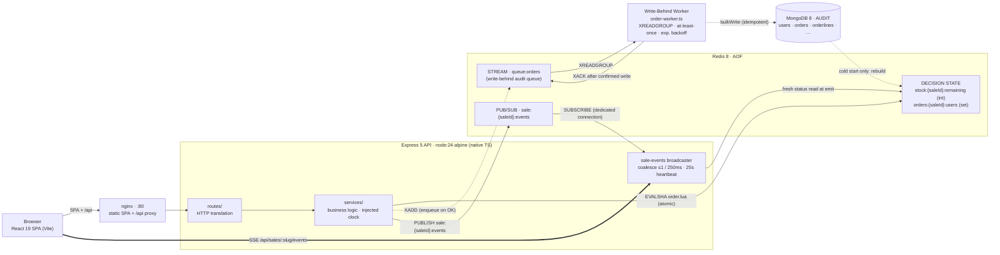

# Flash Sale System

A configurable limited-stock flash sale that never oversells, always honors an
order it accepted, and keeps the page truthful the whole way through.

## Tech stack

| Layer | Technology |
| --- | --- |
| Runtime | Node.js 24 (native TypeScript type stripping — no build step, no bundler) |
| API | Express 5 · TypeScript |
| Decision store | Redis 8 (AOF), driven by a single atomic Lua script |
| Write-behind queue | Redis Stream (`queue:orders`) + consumer group worker |
| Audit store | MongoDB 8 · Mongoose |
| Realtime | Server-Sent Events (SSE) over Redis pub/sub |
| Frontend | React 19 · Vite · nginx (static + /api reverse proxy) |
| Logging & security | pino / pino-http · helmet |
| Testing | Vitest · React Testing Library · k6 (load) |
| Packaging | npm workspaces monorepo · Docker · Docker Compose |

Redis is the concurrency core and MongoDB is the audit trail. Accepted orders
are enqueued to a Redis Stream and drained to MongoDB by a background worker —
keeping MongoDB off the hot path while narrowing the audit under-count window
versus a plain fire-and-forget write. The React SPA is built and served by a
separate nginx container. See [`docs/architecture.md`](docs/architecture.md)
for how these fit together.

## Architecture



Three roles are kept strictly separate: **Redis** is the decision layer (the only
state a request reads or writes — remaining stock and the set of buyers — with a
single Lua script as the sole writer while serving); **MongoDB** is the audit
layer (written by the background worker after it drains the Redis Stream, read
only at cold start to rebuild Redis); and the **clock** is the API server's own
UTC `Date.now()`, never the client's.

Redis keys are namespaced by the MongoDB `ObjectId` of the active sale document
(`stock:{saleId}:remaining`, `orders:{saleId}:users`, `sale:{saleId}:events`), so
multiple sales can coexist in the same Redis instance.

The full design — layers, request flows, the restart gate, failure behavior, and
trade-offs — lives in [`docs/architecture.md`](docs/architecture.md).

### Key trade-offs

Each choice buys a core invariant (no oversell · idempotent identity · fail
closed) at a named cost. Full reasoning — alternatives weighed and when to
revisit each — is in
[`docs/architecture.md` §11](docs/architecture.md#11-trade-offs).

| Decision | Buys | Costs |
| --- | --- | --- |
| One atomic Lua script owns the decision | No oversell / one-per-user by construction | Hot-path logic in Lua, not TypeScript |
| Redis decides; write-behind worker records to Mongo | Single-store hot path, clean recovery, narrow audit gap | Gap between EVALSHA OK and XADD; worker crash leaves PEL until restart |
| Fail closed on Redis loss (503, never a guess) | Correctness under partial failure | Availability — Redis down means the sale is down |
| Synchronous order decision, no decision queue | Immediate, interpretable verdicts | No burst shock absorber; scale the API tier head-on |
| Email as the idempotency key | Honest retries, no session/account needed | Case + NFC normalized so one mailbox is one customer; provider aliases (plus-tags, gmail dots) are an accepted bypass |
| Stateless API, scale by widening the tier | Add instances freely without weakening the guarantee | One Redis primary is the shared throughput ceiling |
| SSE over Redis pub/sub for live status | Plain-HTTP one-way stream, coalesced frames | One-way only; a stateful broadcaster + client fallback ladder |
| Native TS, no build step | The code that runs is the code on disk | Pins a modern Node; no bundler packaging for the server |

## Quick start

```bash
make deploy    # build all images, seed MongoDB, then start: api · worker · nginx client · redis · mongo
```

`make deploy` starts MongoDB, runs `db/scripts/seed-db.ts` to provision the sale
and product data, then brings up the full stack. Open <http://localhost> (nginx
on port 80 — SPA + API).

> The write-behind worker runs as a separate container (`--profile worker`).
> Use `WORKER_COLOCATED=true` to fold it into the API process instead.

Sale timing, stock, and product config live in MongoDB. Edit the JSON files in
`db/data/` to change them (see [Configuration](#configuration)).

## Configuration

### Sale and product config (MongoDB — Story 6-1)

Sale timing, stock, and product data are stored in MongoDB, not env vars. Edit
the JSON files in `db/data/` then provision (or re-provision) with:

```bash
npm run seed          # node db/scripts/seed-db.ts (uses $MONGODB_URI)
make seed             # same, for the local docker-compose stack
```

`make deploy` runs the seed step automatically after the stores are healthy.

The data files (`db/data/*.json`) are JSON arrays — one file per collection:

| File | Collection | Unique key |
| --- | --- | --- |
| `products.json` | `products` | `sku` |
| `sales.json` | `sales` | `slug` |
| `saleproducts.json` | `saleproducts` | `saleSlug` + `productSku` (resolved to ObjectIds) |
| `inventories.json` | `inventories` | `productSku` (resolved to ObjectId) |

The script is **idempotent** — re-running updates mutable fields (`$set`).
`inventories.initialQuantity` uses `$setOnInsert` and is never overwritten.

Accepted CLI flags: `--mongoUri` (overrides `$MONGODB_URI`) and `--dataDir`
(overrides the default `db/data` path).

> Changing `stockQuantity` in `db/data/sales.json` against a Redis that already
> holds sale state is a warm-start **no-op** (Redis is the concurrency truth
> until reset). Reset with `docker compose down -v` or the stress harness's
> reset step.

### Infrastructure environment variables

Parsed and validated once at boot; an invalid value fails fast before listen.

| Variable | Default | Meaning |
| --- | --- | --- |
| `REDIS_URL` | `redis://localhost:6379` | Redis 8, AOF enabled |
| `MONGODB_URI` | `mongodb://localhost:27017/flash-sale` | Audit database and sale config |
| `PORT` | `3000` | API listen port |
| `WORKER_COLOCATED` | `false` | `true`: run the write-behind worker inside the API process. `false` / unset: run the worker separately (`src/worker/index.ts` or the `worker` Compose service). |

## Development

```bash
npm install                      # all workspaces, one root lockfile
docker compose up -d redis mongo # stores only (ports 6379 / 27017 published)
npm run seed                     # provision sale + product in MongoDB (once, idempotent)
npm run dev                      # server :3000 + worker + Vite client :5173 (/api proxied)
```

`npm run dev` starts three concurrent processes: the API server (`:3000`), the
write-behind worker, and the Vite dev client (`:5173`). `npm run seed` uses
`$MONGODB_URI` if set, otherwise connects to `localhost:27017`.

Gates:

```bash
npm test                         # vitest across workspaces
npm run typecheck                # tsc --noEmit (strict)
```

## Build & run

```bash
make deploy                      # build all images and start the full stack
make down                        # stop the stack
make clean                       # stop and remove volumes + local images
make worker-logs                 # tail worker container logs only
```

`make help`-style targets live in the `Makefile`; `docker compose` works directly
as well. `make build` always builds both `Dockerfile.server` and `Dockerfile.client`
images. `make deploy` activates the `worker` Compose profile by default (separate
container); set `WORKER_COLOCATED=true` to omit the profile and run the worker
co-located.

## Proving it

Run the fairness claim — many concurrent buyers against limited stock:

```bash
npm run stress        # or: make stress
```

Prerequisite: Docker. k6 runs from your `PATH` if present, otherwise from the
`grafana/k6` image. The harness stops the API, resets the stores, restarts the
API, drives the concurrent burst with k6, then verifies the results against the
stores. Redis (`SCARD orders:{saleId}:users` + `stock:{saleId}:remaining`) is the
authoritative fairness record: every fairness count is an exact equality against
the API's own seeded stock (the harness never asserts against a quantity it chose).
The async Mongo audit is reconciled with a tolerance — an accepted under-count (a
Redis accept whose durable write was lost) passes with a note, while an
over-count (a phantom order Mongo holds but Redis never accepted) hard-fails. It
then re-checks that a past-window sale rejects every attempt.
Buyer count (`ATTEMPTS`, default 5,000), virtual users (`VUS`, default 500), and
stock (`STOCK_QUANTITY`, default 100) are all overridable, so the same proof runs
at any scale. The combined exit code is the pass/fail signal. See §9 of
[`docs/architecture.md`](docs/architecture.md) for the full protocol.

### Stress configuration

The stress harness uses its own `.env.stress` file so the harness always agrees
with the API container on `STOCK_QUANTITY` and the sale window. Explicit
environment variables still override — `STOCK_QUANTITY=200 npm run stress` works
as expected. The sale window and stock used by the API come from MongoDB (seeded
by `db/scripts/seed-db.ts`); `.env.stress` carries the same values so the verifier
can assert against the same quantities.

## Project layout

An npm-workspaces monorepo. Three workspaces, plus docs and the Docker stack at
the root.

```
server/   Express 5 + TypeScript API (Node 24 native type stripping — no bundler)
          src/
            index.ts        boot entry: bootstrap() then listen(); WORKER_COLOCATED
                            starts the write-behind worker in this same process
            bootstrap.ts    the single composition root (shared with tests)
            app.ts          Express pipeline + central error middleware
            routes/         HTTP translation only
            services/       all business logic (framework-free, injected clock)
            adapters/       stores & ports: redis/ · mongo/ · payment/ · config.ts
            worker/         write-behind consumer worker
              order-worker.ts  XREADGROUP polling loop · at-least-once · exp. backoff
              index.ts         standalone entrypoint (node src/worker/index.ts)
          test/             unit + integration tests

client/   React 19 + Vite SPA — built into the nginx image, served at /
          src/
            components/     presentational UI
            hooks/          active-sale redirect · realtime status · order state machines
            api/            typed wire clients (sale, order) — slug-parameterized
            router.tsx      React Router: / → /sale/:slug redirect · /sale/:slug · * → 404
          nginx.conf        static serving + /api reverse proxy to the API container

stress/   the fairness proof (imports no server code — an independent observer)
            run.ts          orchestrator: stop → reset → start → k6 → verify → window
            reset.ts        offline store wipe (guarded)
            k6-order.js     the concurrent burst
            verify.ts       equality checks against Mongo + Redis

db/       scripts/
            seed-db.ts    idempotent DB provisioner — run before first server start
                          (`npm run seed` / `make seed`)
          data/
            products.json     seed data — [{ sku, name, originalPrice }]
            sales.json        seed data — [{ slug, name, startTime, endTime, stockQuantity }]
            saleproducts.json seed data — [{ saleSlug, productSku, flashSalePrice }]
            inventories.json  seed data — [{ productSku, initialQuantity }]

docs/     architecture.md   the full architecture reference
Dockerfile.server       node:24-alpine API image (no client build)
Dockerfile.client       nginx image: Vite build → static SPA + /api proxy
docker-compose.yml      api · worker (profile) · client (nginx) · redis:8-alpine · mongo:8
Makefile                install / seed / dev / build / deploy / stress / clean / worker-logs targets
```

## Domain model

The system models a single flash sale with one product. Eight Mongo collections
ship; Redis holds the runtime truth.

**MongoDB (durable audit) — three categories:**

| Category | Collections | Role |
| --- | --- | --- |
| DB-provisioned constants | `products`, `sales`, `saleproducts`, `inventories` | Written by `db/scripts/seed-db.ts` (idempotent, not per-boot). Read by `bootstrap.ts` to select the active sale and load stock + product config. `Inventory.initialQuantity` is set on first seed (`$setOnInsert`) and never decremented — concurrency truth lives in Redis. |
| Per-order writes | `users`, `orders`, `orderlines` | Written by the background worker after draining `queue:orders`. `Order` carries a compound unique index on `(saleId, email)` as defense-in-depth. |

**Redis (runtime truth) — two keys + one channel + one stream:**

| Key | Type | Purpose |
| --- | --- | --- |
| `stock:{saleId}:remaining` | integer | Units left; also the warm/cold boot sentinel. `{saleId}` is the MongoDB `ObjectId` of the active sale. |
| `orders:{saleId}:users` | set | Buyer emails with confirmed orders |
| `sale:{saleId}:events` | pub/sub | Type-only event strings (`order.accepted`, `sale.sold_out`, `sale.started`, `sale.ended`) |
| `queue:orders` | stream | Write-behind audit queue; the worker drains it to MongoDB via XREADGROUP / XACK. |

The Lua script, the boot rebuild, and the offline reset script are the only
permitted writers of the two state keys. The full ER diagram and interface
catalog live in
[`docs/architecture.md` §5](docs/architecture.md#5-data-and-state-model).

## Known limitations

These are accepted properties of the v1 design, not overlooked bugs. Each is
documented so a future maintainer inherits the reasoning.

**Audit under-count window.** A crash between "Redis accepted the order" (Lua
script returns `OK`) and "order enqueued to the Redis Stream" (`XADD
queue:orders`) permanently loses that audit row. Once in the stream, at-least-once
delivery guarantees eventual persistence. The buyer keeps their order (Redis is
correct; a retry returns 200), but Mongo under-counts by one. This window is
smaller than a plain fire-and-forget write but not zero.

**Single Redis primary is the throughput ceiling.** The API tier scales
horizontally (stateless, shared Redis), but every accepted order is one
round-trip to one Redis primary. A single primary handles a flash sale's write
rate comfortably; it is the bottleneck by design.

**Email aliasing bypass.** Email is NFC-normalized and case-folded
(`A@x.com` = `a@x.com`), but provider-specific aliases (Gmail dots, `+tags`)
are not folded — a determined buyer can order twice with `a@gmail.com` and
`a+1@gmail.com`. Correct alias handling is provider-specific and easy to get
subtly wrong; an authenticated account id is the production fix.

**No rate limiting.** The API has no per-client throttle. The Lua script's
atomicity prevents oversell regardless of request volume, but an abusive client
can waste bandwidth. Rate limiting is an operational concern layered above the
correctness guarantee.

**No authentication or payment.** Identity is an email string; payment is a
no-op adapter. Both are explicit non-goals for v1, with the architecture
designed so real implementations slot in without disturbing the decision core.

**SSE connection cap.** HTTP/1.1 limits browsers to roughly 6 concurrent
connections per origin. A single-tab demo is unaffected, but multiple tabs from
one browser will exhaust the budget. HTTP/2 or a managed WebSocket tier removes
the limit.

**Redis command timeout can 503 a committed order.** A network timeout may
return 503 for an order that actually committed server-side. The idempotent
retry recovers on the next attempt, but the first response was wrong.

## Roadmap

Improvements below are ordered by value, with the highest-impact items first.
Each builds on the current architecture without disturbing the decision core.

**Payment integration.** The `PaymentProvider` port already exists with a no-op
implementation. A real adapter (Stripe, etc.) slots in after the Redis `OK`,
with a reserve-then-confirm flow requiring a new `Reservation` collection
(schema to be designed alongside the payment adapter).
This is the first feature that turns the system from a demo into a real sale.

**Authentication and account identity.** Replace the raw email with an
authenticated user id. The set-membership mechanism is unchanged — only the value
stored in `orders:{saleId}:users` changes. Eliminates the email aliasing bypass entirely.

**Rate limiting.** A per-IP or per-email throttle at the API edge (or via a
reverse proxy). Prevents bandwidth waste from abusive clients without affecting
the fairness guarantee.

**Observability.** Structured metrics (Prometheus counters for orders, stock,
latency histograms), distributed tracing (OpenTelemetry), and alerting.
Currently the system logs one pino line per request.

**CI pipeline.** Automated gates: lint, typecheck, unit tests, integration
tests, and the stress harness on every push. Currently all gates are manual
(`npm test`, `npm run typecheck`, `make stress`).

**Multi-node scale-out.** Redis Cluster or Redlock for write distribution across
nodes. The single-writer Lua script is the correct design for one primary; at
true horizontal scale, per-node sub-inventories with a coordinator become
necessary.

**Runtime sale administration.** An admin endpoint to adjust the sale window or
stock without restarting the API. Sale config now lives in MongoDB (Story 6-1),
so the data layer is ready; the missing piece is a write endpoint + live
reconfiguration of the in-process timer and Redis keys.

**Service decomposition.** If the system grows beyond a single product and sale,
the monolith splits along its existing layer boundaries: an order service, an
inventory service, and a notification service, each owning its store.
