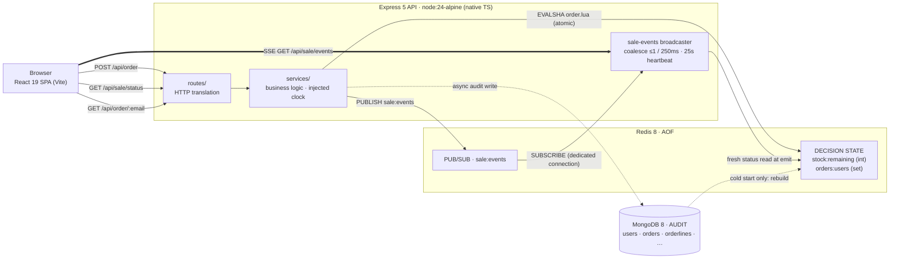

# Flash Sale System

A configurable limited-stock flash sale that never oversells, always honors an
order it accepted, and keeps the page truthful the whole way through.

## Tech stack

| Layer | Technology |
| --- | --- |
| Runtime | Node.js 24 (native TypeScript type stripping — no build step, no bundler) |
| API | Express 5 · TypeScript |
| Decision store | Redis 8 (AOF), driven by a single atomic Lua script |
| Audit store | MongoDB 8 · Mongoose |
| Realtime | Server-Sent Events (SSE) over Redis pub/sub |
| Frontend | React 19 · Vite |
| Logging & security | pino / pino-http · helmet |
| Testing | Vitest · React Testing Library · k6 (load) |
| Packaging | npm workspaces monorepo · Docker · Docker Compose |

Redis is the concurrency core and MongoDB is the audit trail; the React SPA is
built into the API image and served from it. See
[`docs/architecture.md`](docs/architecture.md) for how these fit together.

## Architecture



Three roles are kept strictly separate: **Redis** is the decision layer (the only
state a request reads or writes — remaining stock and the set of buyers — with a
single Lua script as the sole writer while serving); **MongoDB** is the audit
layer (written asynchronously after a decision, read only at cold start to
rebuild Redis); and the **clock** is the API server's own UTC `Date.now()`, never
the client's.

The full design — layers, request flows, the restart gate, failure behavior, and
trade-offs — lives in [`docs/architecture.md`](docs/architecture.md).

### Key trade-offs

Each choice buys a core invariant (no oversell · idempotent identity · fail
closed) at a named cost. Full reasoning — alternatives weighed and when to
revisit each — is in
[`docs/architecture.md` §11](docs/architecture.md#11-trade-offs).

| Decision | Buys | Costs |
| --- | --- | --- |
| One atomic Lua script owns the decision | No oversell / one-per-user by construction | Hot-path logic in Lua, not TypeScript |
| Redis decides, Mongo records (async) | Single-store hot path, clean recovery | Audit under-count if a crash lands mid-write |
| Fail closed on Redis loss (503, never a guess) | Correctness under partial failure | Availability — Redis down means the sale is down |
| Synchronous order flow, no queue | Immediate, interpretable verdicts | No burst shock absorber; scale the API tier head-on |
| Email as the idempotency key | Honest retries, no session/account needed | Case + NFC normalized so one mailbox is one customer; provider aliases (plus-tags, gmail dots) are an accepted bypass |
| Stateless API, scale by widening the tier | Add instances freely without weakening the guarantee | One Redis primary is the shared throughput ceiling |
| SSE over Redis pub/sub for live status | Plain-HTTP one-way stream, coalesced frames | One-way only; a stateful broadcaster + client fallback ladder |
| Native TS, no build step | The code that runs is the code on disk | Pins a modern Node; no bundler packaging for the server |

## Quick start

```bash
docker compose up      # healthchecked redis + mongo, then the api on :3000
```

Open <http://localhost:3000>. The compose defaults ship an **already-active**
sale (window `2026-01-01T00:00:00Z` → `2027-01-01T00:00:00Z`, 100 units), so the
page is live the moment the stack is up. Override the window and stock with a
`.env` file next to `docker-compose.yml` (see [Configuration](#configuration)).

## Configuration

Environment variables only — parsed and validated once at boot, fail-fast. There
is no runtime admin endpoint.

| Variable | Required | Default | Meaning |
| --- | --- | --- | --- |
| `SALE_START_TIME` | **yes** | — | ISO 8601; parsed to UTC epoch ms at boot |
| `SALE_END_TIME` | **yes** | — | ISO 8601; must be strictly after the start |
| `STOCK_QUANTITY` | no | `100` | Positive integer; units on sale |
| `REDIS_URL` | no | `redis://localhost:6379` | Redis 8, AOF enabled |
| `MONGODB_URI` | no | `mongodb://localhost:27017/flash-sale` | The audit database |
| `PORT` | no | `3000` | API port |

An invalid or missing required value fails the boot before the server listens.
Compose ships defaults for an active sale; override them in `.env`:

```bash
SALE_START_TIME=2026-07-13T12:00:00Z
SALE_END_TIME=2026-07-13T13:00:00Z
STOCK_QUANTITY=100
```

> Changing `STOCK_QUANTITY` against a Redis that already holds sale state is a
> deliberate **no-op** (a warm start touches nothing). Reset with the harness's
> reset step, or `docker compose down -v`.

## Development

```bash
npm install                      # all workspaces, one root lockfile
docker compose up -d redis mongo # stores only (ports 6379 / 27017 published)
cp .env.example .env             # set the sale window to develop against
npm run dev                      # server :3000 + Vite client :5173 (/api proxied)
```

Gates:

```bash
npm test                         # vitest across workspaces
npm run typecheck                # tsc --noEmit (strict)
```

## Build & run

```bash
make deploy                      # build the api image and start the full stack
make down                        # stop the stack
make clean                       # stop and remove volumes + local images
```

`make help`-style targets live in the `Makefile`; `docker compose` works directly
as well (`docker compose build`, `docker compose up -d`).

## Proving it

Run the fairness claim — many concurrent buyers against limited stock:

```bash
npm run stress        # or: make stress
```

Prerequisite: Docker. k6 runs from your `PATH` if present, otherwise from the
`grafana/k6` image. The harness stops the API, resets the stores, restarts the
API, drives the concurrent burst with k6, then verifies the results against the
stores. Redis (`SCARD orders:users` + `stock:remaining`) is the authoritative
fairness record: every fairness count is an exact equality against the API's own
seeded stock (the harness never asserts against a quantity it chose). The async
Mongo audit is reconciled with a tolerance — an accepted under-count (a Redis
accept whose durable write was lost, NFR-4) passes with a note, while an
over-count (a phantom order Mongo holds but Redis never accepted) hard-fails. It
then re-checks that a past-window sale rejects every attempt.
Buyer count (`ATTEMPTS`, default 5,000), virtual users (`VUS`, default 500), and
stock (`STOCK_QUANTITY`, default 100) are all overridable, so the same proof runs
at any scale. The combined exit code is the pass/fail signal. See §9 of
[`docs/architecture.md`](docs/architecture.md) for the full protocol.

## Project layout

An npm-workspaces monorepo. Three workspaces, plus docs and the Docker stack at
the root.

```
server/   Express 5 + TypeScript API (Node 24 native type stripping — no bundler)
          src/
            index.ts        boot entry: bootstrap() then listen()
            bootstrap.ts    the single composition root (shared with tests)
            app.ts          Express pipeline + central error middleware
            routes/         HTTP translation only
            services/       all business logic (framework-free, injected clock)
            adapters/       stores & ports: redis/ · mongo/ · payment/ · config.ts
          test/             unit + integration tests

client/   React 19 + Vite SPA — built into the api image, served at /
          src/
            components/     presentational UI
            hooks/          realtime status + order state machines
            api/            typed wire clients (sale, order)

stress/   the fairness proof (imports no server code — an independent observer)
            run.ts          orchestrator: stop → reset → start → k6 → verify → window
            reset.ts        offline store wipe (guarded)
            k6-order.js     the concurrent burst
            verify.ts       equality checks against Mongo + Redis

docs/     architecture.md   the full architecture reference
Dockerfile              multi-stage api image (client build → node:24-alpine)
docker-compose.yml      api + redis:8-alpine (AOF) + mongo:8 — the one-command stack
Makefile                install / dev / build / deploy / stress / clean targets
```
