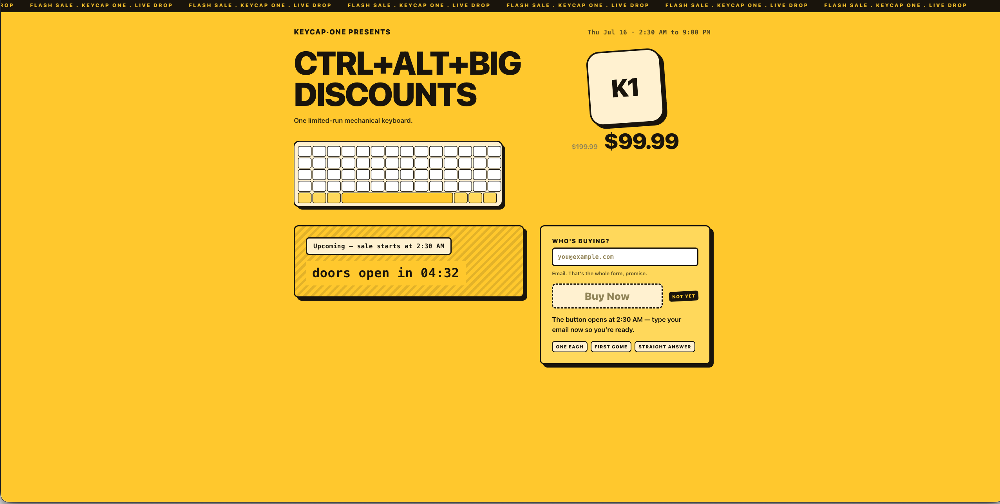
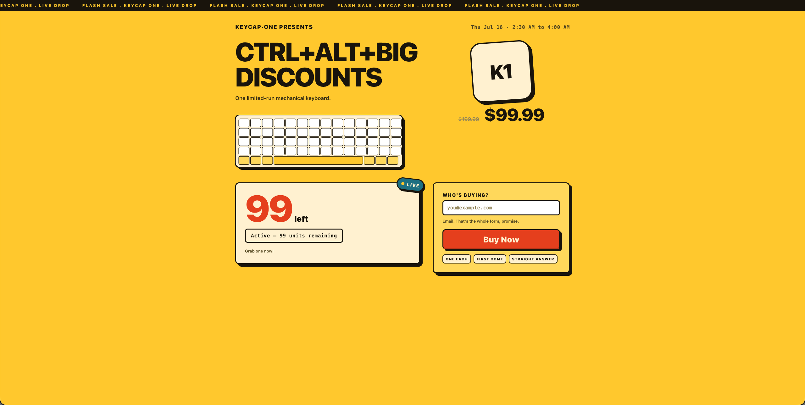
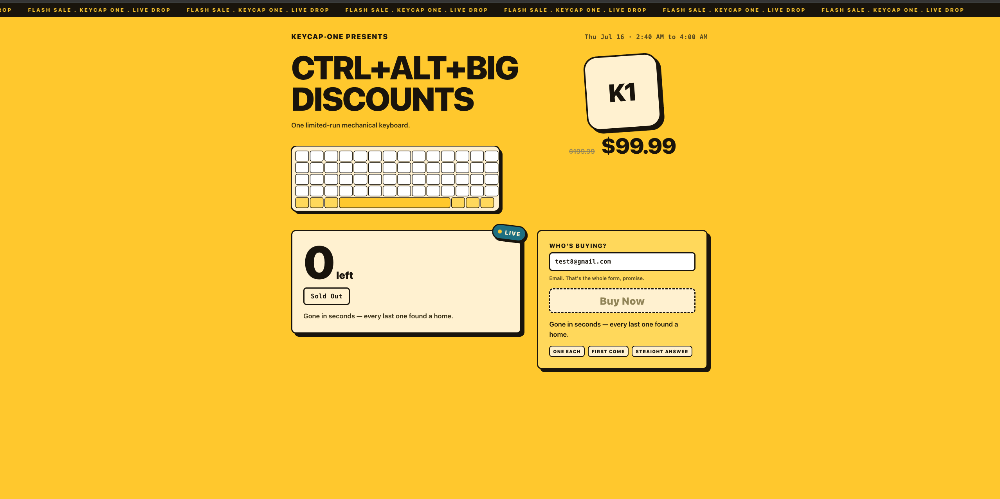
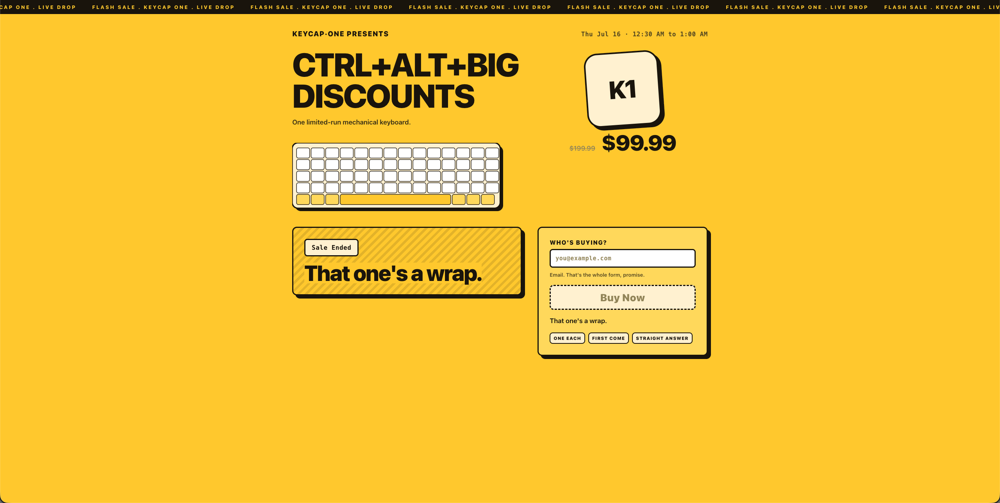

# Flash Sale — Site Behavior Showcase

A configurable limited-stock flash sale that never oversells, always honors an order it accepted, and keeps the page truthful the whole way through. The UI is a single React SPA that connects to the server over **Server-Sent Events (SSE)** — every state change below arrives in real time, with no polling or page refresh required.

> **Demo video:** [`docs/media/demo.mov`](docs/media/demo.mov)

---

## Sale States

The page moves through four distinct states driven entirely by server time and live stock. The transition is pushed to every connected browser the moment it happens.

### 1. Upcoming

The sale window hasn't opened yet. The status panel shows a live countdown to the exact start time and the "Buy Now" button is locked with a **NOT YET** badge. Visitors can type their email in advance so they're ready the instant the window opens — the field is active, the button is not.

---

### 2. Active

The sale is live. A **LIVE** badge appears on the status panel and the stock counter turns red, ticking down in real time as orders are accepted. The "Buy Now" button becomes clickable — one email is all it takes to enter the queue. The server enforces one order per email address at the Redis layer; a duplicate attempt returns a clear rejection, not a silent failure.

---

### 3. Sold Out

Stock hits zero. The counter lands on **0 left**, the status badge flips to **Sold Out**, and the "Buy Now" button is disabled immediately across every open browser tab via SSE. The sale window is still technically open but no further orders are accepted — the page is truthful rather than letting buyers attempt a doomed purchase. The message "Gone in seconds — every last one found a home" confirms the drop completed cleanly.

---

### 4. Sale Ended

The sale window has closed (time-based expiry, regardless of remaining stock). The status panel returns to the striped holding pattern, now stamped **Sale Ended**, and the copy reads *"That one's a wrap."* The "Buy Now" button stays disabled and the form is inert. Any attempt to POST an order after this point is rejected server-side with a `409`.

---

## What the UI Communicates at Each State

| State | Status badge | Stock counter | Buy Now | SSE badge |
|---|---|---|---|---|
| Upcoming | `Upcoming – sale starts at HH:MM` | Hidden | Locked · `NOT YET` | — |
| Active | `Active – N units remaining` | Live red countdown | **Enabled** | `LIVE` |
| Sold Out | `Sold Out` | `0 left` | Disabled | `LIVE` |
| Sale Ended | `Sale Ended` | Hidden | Disabled | — |

---

## How the Real-Time Updates Work

The browser opens a persistent SSE connection to `GET /api/sales/:slug/events`. The server publishes type-only events (`sale.started`, `order.accepted`, `sale.sold_out`, `sale.ended`) to a Redis pub/sub channel; a coalescing broadcaster fans them out to all connected clients at most once per 250 ms. On each event the client re-reads the authoritative status from the server and re-renders — the stock number shown is always the live Redis value, never a client-side guess.

If the SSE stream drops, the client falls back to polling automatically and reconnects when the stream recovers.

---

## Fairness Guarantee

The "Buy Now" flow makes exactly one decision per request: a single atomic Lua script executed in Redis checks remaining stock and the set of existing buyers simultaneously. Either the order is accepted (HTTP `202`) or rejected (HTTP `409`) — there is no in-between state and no race condition, regardless of how many concurrent buyers hit the button at once. The stress harness (`make stress`) verifies this claim against 5,000 concurrent virtual users with a 100-unit stock limit and requires a 0 % oversell rate to pass.
