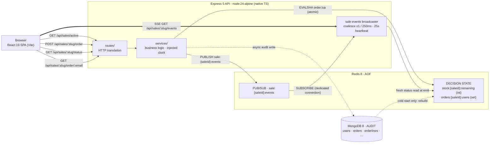
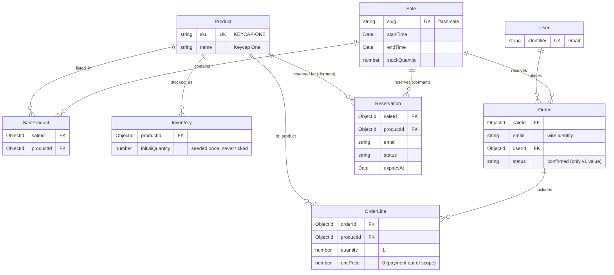

# Architecture

## 1. Purpose and invariants

The system sells a fixed number of units (default 100) to a large concurrent
audience within a bounded sale window. The implementation enforces three
invariants:

- **No oversell.** At most `STOCK_QUANTITY` orders are accepted.
- **Idempotent identity.** A buyer's email is the identity key. A repeat attempt
  returns the same success, never a duplicate and never a spurious error, at any
  time.
- **Fail closed.** When the authoritative store is unreachable, the system returns
  an error rather than a guess. A refusal is safe; a guess can oversell.

## 2. Topology



Three roles are kept strictly separate:

- **Redis is the decision layer.** It holds the only state a request reads or
  writes: remaining stock and the set of buyers. A single Lua script is the sole
  writer of that state while the API serves.
- **MongoDB is the audit layer.** It is written asynchronously after a decision
  and is never read on a request path. Its only runtime read is at cold start, to
  rebuild Redis.
- **The clock is the API server's `Date.now()`.** Client clocks are never
  consulted; the sale window is the server's UTC time alone.

## 3. Server layers

The server enforces a one-way dependency rule — `routes/ → services/ →
adapters/` — with business logic confined to `services/`. Routes translate HTTP;
adapters move data to and from stores; both hold zero business rules. Services are
framework-free: no `express`, `redis`, or `mongoose` imports.

### 3.1 Boot (`src/index.ts`, `src/bootstrap.ts`)

`index.ts` calls `bootstrap()`, then `listen()`. Any failure — invalid config,
unreachable store, a subscriber that will not connect — rejects `bootstrap()` and
exits non-zero before `listen()`. This is the boot-time form of failing closed.

`bootstrap()` is the single composition root, shared verbatim by the server and by
integration tests. Its order is fixed:

1. **Config** — parsed and validated first.
2. **Redis connect** — bounded timeout; node-redis would otherwise retry forever,
   so connect is raced against a timeout and the client is destroyed on failure.
3. **Mongo connect.**
4. **Lua script registration** — `SCRIPT LOAD` and SHA cache.
5. **Mongo seed** — idempotent upserts of Product, Sale, SaleProduct, and Inventory.
6. **Multi-sale overlap validation** — fails boot if more than one sale's window
   overlaps `now()`; prevents ambiguous active-sale selection.
7. **Active sale selection** — selects the sale by priority: within-window first,
   then nearest upcoming, then most-recently-ended.
8. **Sale resolver** — middleware factory that resolves `:slug` URL params to a
   `SaleSummary` with a 60-second in-memory cache.
9. **Key migration** — one-time rename of v1.0 flat Redis keys (`stock:remaining`,
   `orders:users`) to v1.1 namespaced keys (`stock:{saleId}:remaining`,
   `orders:{saleId}:users`). No-op when flat keys are absent.
10. **Warm/cold reconciliation** — the restart gate (§6): warm start touches
    nothing; cold start rebuilds Redis from Mongo confirmed order emails.
11. **Sale-events layer** — publisher on the main connection, broadcaster, and
    subscriber on a dedicated duplicated connection; window-boundary timers for
    future boundaries only.
12. **App assembly.**

`bootstrap()` returns `teardown()`, which unwinds in reverse (timers, broadcaster,
subscriber, Mongo, Redis).

### 3.2 App assembly (`src/app.ts`)

The Express 5 pipeline: `helmet` → `pino-http` (one log line per request) → an
8 kb JSON body limit → the `/api` router → optional static SPA → an envelope 404 →
one central error middleware. Express 5 forwards rejected async handlers
automatically, so there is no per-route `try/catch`. Every error becomes a uniform
envelope, `{ success: false, error: string }`, with the status taken from the error
object. `RedisUnavailableError` carries status `503` and an `expose` flag so its
message is preserved.

### 3.3 Routes (`src/routes/`)

Ten endpoints total: six v1.1 slug-scoped endpoints form the primary API surface;
four v1.0 aliases remain for the stress harness and backward compatibility.

The `:slug` parameter in v1.1 routes is resolved to a `SaleSummary` by the
`SaleResolver` middleware before the handler runs. An unknown slug yields `404`
on v1.1 routes. On v1.0 alias routes the resolver attaches the active sale
without erroring; a missing sale lets the handler return `404`.

| Method & path | Purpose |
| --- | --- |
| `GET /api/sales/active` | Discover the active sale's slug. `404` if no sales exist. |
| `GET /api/sales/:slug` | Sale details with a product join, including live `remaining` stock. `remaining` is `null` when Redis is down — the one read path that degrades gracefully rather than failing closed. |
| `GET /api/sales/:slug/status` | Sale status body: `status`, `stock`, window bounds. |
| `POST /api/sales/:slug/order` | Atomic order attempt. |
| `GET /api/sales/:slug/order/:email` | Membership read (idempotency / convenience). |
| `GET /api/sales/:slug/events` | SSE stream of `status` frames. |
| `GET /api/sale/status` | v1.0 alias → same handler as `GET /api/sales/:slug/status`. |
| `POST /api/order` | v1.0 alias → same handler as `POST /api/sales/:slug/order`. |
| `GET /api/order/:email` | v1.0 alias → same handler as `GET /api/sales/:slug/order/:email`. |
| `GET /api/sale/events` | v1.0 alias → same handler as `GET /api/sales/:slug/events`. |

The order route validates the email (trim; empty or greater than 256 characters
is a `400` `"Email is required."`) and canonicalizes it (NFC-normalize + case-fold)
for the fairness key before invoking the service, so a `400` never reaches Redis.
It then maps the service outcome to the wire contract. The SSE route awaits the
snapshot frame before writing headers, so a Redis-down snapshot yields a clean
`503` rather than a half-open stream.

Full response set:

| Endpoint | Codes |
| --- | --- |
| `GET /api/sales/active` | `200 { slug }` · `404` no sales configured |
| `GET /api/sales/:slug` | `200` sale + products · `404` unknown slug |
| `POST /api/sales/:slug/order` (and v1.0 alias) | `201` created · `200` already ordered (outranks window/stock) · `409` sold out / sale not active · `400` empty or > 256-char email · `503` Redis loss |
| `GET /api/sales/:slug/order/:email` (and v1.0 alias) | `200 { ordered: true｜false }` · `400` empty or > 256-char email · `503` Redis loss — the membership read is a live Redis read, so it fails closed too |

### 3.4 Services (`src/services/`)

- **`sale-status.ts`** — sole owner of the status state machine. Given the injected
  clock and a stock read, it computes `upcoming` / `active` / `ended` / `sold_out`
  over the window `[start, end)`: `active` inside the window with stock remaining,
  `sold_out` inside the window at zero. Stock is read in every state, so a Redis
  outage fails closed even outside the window. Both HTTP and SSE compose their
  bodies through this function.

- **`order.ts`** — owns response precedence. Outside the window, a single
  membership check yields `already` for an order holder, otherwise `inactive`.
  Inside the window, the decision is delegated to the Lua script and the verdict is
  mapped: `OK → created`, `ALREADY → already`, `SOLD_OUT → sold_out`. After an
  `OK` only, three side effects fire-and-forget: the Mongo audit write, the payment
  charge, and event publishes (`order.accepted` always; `sale.sold_out` once, from
  the request whose `DECR` reached zero). None is awaited, none affects the HTTP
  outcome, and none is rolled back — no compensating `INCR`/`SREM` exists.

- **`sale-events.ts`** — owns the realtime rules: a single serialized writer that
  composes each frame once through the status service (a fresh read at emit time);
  coalescing to at most one frame per 250 ms; terminal transitions (`sold_out`,
  `ended`) emitted immediately and guaranteed last; a snapshot on every reconnect
  (no replay, no `Last-Event-ID`); a 25 s named `heartbeat` event (observable by
  the client watchdog); and mid-stream fail
  closed — if truth cannot be read, every stream is closed. It also arms
  `sale.started` / `sale.ended` timers for future boundaries only; elapsed
  boundaries arm nothing, since snapshot-on-connect heals them.

- **`clock.ts`** — the injection seam: `systemClock = () => Date.now()`. Services
  take the clock injected; routes and adapters never call `Date.now()` for window
  decisions.

- **`payment.ts`** — defines a `PaymentProvider` port. The only v1 implementation
  is an instant-approve no-op. Payment sits behind acceptance and cannot fail an
  order.

### 3.5 Adapters (`src/adapters/`)

Adapters are narrow command surfaces over the stores, each bounded by a per-command
timeout so a hang becomes a failure.

**Redis (`adapters/redis/`)**

- **`order.lua`** — the authoritative decision. In one atomic, single-threaded
  unit it reads `stock:{saleId}:remaining` (erroring if the key is missing rather
  than fabricating a `0`), returns `ALREADY` if the email is a member of
  `orders:{saleId}:users`, returns `SOLD_OUT` if stock is `≤ 0`, otherwise `SADD`s
  the email and `DECR`s stock, returning `OK` with the post-decrement remaining.
  While the API serves, this script is the only writer of both keys; there is no
  app-side lock.
- **`orders.ts`** — registers the script (`SCRIPT LOAD` + SHA cache) and invokes it
  by `EVALSHA`, with automatic `EVAL` fallback and re-cache on a `NOSCRIPT` reply.
  Exposes the single `SISMEMBER` used outside the window. Every reply is validated;
  an unparseable reply fails closed. Exports `ordersKeyFor(saleId)`.
- **`stock.ts`** — reads `stock:{saleId}:remaining`; defines `RedisUnavailableError`
  (status `503`, `expose: true`) and the shared `bounded()` timeout wrapper. A
  missing key throws rather than returning a number. Exports `stockKeyFor(saleId)`.
- **`events.ts`** — the `sale:{saleId}:events` pub/sub layer. `PUBLISH` rides the
  main client; `SUBSCRIBE` runs on a dedicated duplicated connection. Payloads are
  type-only: the event string is the message, and consumers recompute truth from a
  fresh read.
- **`reconcile.ts`** — the boot rebuild. `hasStockKey(saleId)` is the warm/cold
  sentinel; `rebuild(emails, remaining, saleId)` writes membership first and the
  stock sentinel last (`DEL → SADD → SET`), so a crash mid-rebuild re-runs the cold
  path on the next boot.
- **`migrate.ts`** — one-time v1.0 → v1.1 flat-key migration. Renames
  `stock:remaining` → `stock:{saleId}:remaining` and `orders:users` →
  `orders:{saleId}:users` when the flat keys are present. No-op on a fresh install
  or after the migration has already run. Invoked at boot before reconciliation
  (§3.1 step 9).
- **`client.ts`** — creates the node-redis client with offline queueing disabled
  and a bounded connect timeout.

**MongoDB (`adapters/mongo/`)**

- **`models.ts`** — the full v1 Mongoose schema: `User`, `Product`, `Sale`,
  `SaleProduct`, `Inventory`, `Order`, `OrderLine`, and a dormant `Reservation`
  that ships but is never written. Unique indexes guard `users.identifier`,
  `products.sku`, `(saleId, productId)`, and `(saleId, email)` on orders as
  defense-in-depth. `Inventory` is seeded once and never decremented per order;
  concurrency truth lives in Redis.
- **`audit.ts`** — the async writer, invoked only after an `OK`: upsert the user,
  insert a confirmed order, insert its order line. A duplicate-key error on
  `(saleId, email)` is swallowed as already-recorded.
- **`seed.ts`** — idempotent boot seed of the domain documents from env config;
  exposes `listConfirmedOrderEmails(saleId)`, the cold-rebuild source, and
  `listAllSales()`, used at boot to validate multi-sale overlap.
- **`catalog.ts`** — `createCatalogReader`. Joins `SaleProduct` → `Product` and
  `Inventory` to produce the product list for `GET /api/sales/:slug`. The live
  `remaining` value comes from a separate Redis read; a missing or unavailable
  Redis value resolves to `null` rather than failing the whole response.
- **`client.ts`** — connection lifecycle only, with a 5 s server-selection timeout.

**Payment (`adapters/payment/noop.ts`)** — the instant-approve provider.

## 4. Request flows

### 4.1 `POST /api/sales/:slug/order` inside the window

```
route validates email (400 on empty/oversized — Redis untouched)
  └─ order service: now ∈ [start, end)? yes
       └─ orders.attempt(email) → EVALSHA order.lua  (atomic)
            ├─ OK        → 201 "Order successful."
            │              async: audit write · payment charge
            │                     publish order.accepted (+ sale.sold_out if remaining == 0)
            ├─ ALREADY   → 200 "You have already ordered this item."
            └─ SOLD_OUT  → 409 "Item is sold out."
```

Outside the window the script never runs: a single `SISMEMBER` distinguishes an
order holder (`200`) from everyone else (`409 "Sale is not active."`). Precedence —
validation → already-ordered → window → stock → created — means an order holder
always wins, including a retry after the sale ends.

### 4.2 `GET /api/sales/:slug/events` (SSE)

The route awaits a fresh snapshot frame (failing closed with `503` if Redis is
down), sends SSE headers, writes the snapshot, and registers the connection.
Thereafter the broadcaster drives the stream: events on `sale:{saleId}:events` trigger a
coalesced, freshly composed `status` frame to every connection; a 25 s heartbeat
keeps intermediaries from closing idle streams; a lost subscriber connection closes
every stream, and a new stream receives a `503`.

### 4.3 Client realtime model

The browser SPA is a React 19 app with three routes: `/` redirects to `/sale/:slug`
via `useActiveSaleRedirect` (which calls `GET /api/sales/active`); `/sale/:slug` is
the main sale page; and `*` is a 404 page. All client API functions
(`fetchSaleStatus`, `fetchSaleDetails`, `placeOrder`, `checkOrder`, `saleEventsUrl`)
are slug-parameterized and call the v1.1 `/api/sales/:slug/…` paths exclusively.

`useSaleStatus(slug)` treats an open SSE stream as the sole writer of the status
view. Polling is a fallback whose writes are discarded while the stream is live. A
`channel` axis (`connecting` / `live` / `degraded` / `offline`) tracks liveness
independently of sale status, so the page never claims "live" over a frozen value. A
`notFound` flag is set on a `404` response from the slug lookup and is terminal —
polling and reconnects stop. After every order attempt the client re-syncs status
once. `placeOrder` is total: a `409`, `503`, dropped socket, or 10 s stall all
resolve to a verdict, so no UI path strands a spinner.

## 5. Data and state model

### 5.1 Domain model

Eight Mongoose collections ship in v1. Schema ships now; behavior is
trigger-gated — some entities are boot-seeded constants, some are written per
order, and one is dormant by design.



**Lifecycle categories:**

| Category | Collections | Behavior |
| --- | --- | --- |
| Boot-seeded constants | `products`, `sales`, `saleproducts`, `inventories` | Upserted idempotently at boot from env config. Never written per order. `Inventory.initialQuantity` is seeded from `STOCK_QUANTITY` but never decremented — concurrency truth lives in Redis. |
| Per-order writes | `users`, `orders`, `orderlines` | Written asynchronously after a Redis `OK` (§4.1). `Order` has a compound unique index on `(saleId, email)` as defense-in-depth. `OrderLine` defaults to qty 1, unitPrice 0 (payment out of scope). |
| Dormant | `reservations` | Schema ships but no code path writes it. Activates at the reserve-then-confirm payment trigger (a future milestone). |

All schemas use `timestamps: true`. Unique indexes guard `users.identifier`,
`products.sku`, `saleproducts(saleId, productId)`, and
`orders(saleId, email)`.

### 5.2 Redis state (runtime truth)

Keys are namespaced by the MongoDB `ObjectId` of the active sale document
(`{saleId}`), so multiple sales can coexist in the same Redis instance.

- `stock:{saleId}:remaining` — integer unit count; also the warm/cold sentinel.
- `orders:{saleId}:users` — set of buyer emails holding a confirmed order.
- `sale:{saleId}:events` — pub/sub channel of type-only event strings.

Permitted writers of the two state keys are exactly three: the Lua script while
serving, the boot rebuild before `listen()`, and the offline reset script.

### 5.3 Key interfaces

| Type | Location | Purpose |
| --- | --- | --- |
| `AppConfig` | `adapters/config.ts` | Boot-parsed env: port, store URLs, stock, sale window (epoch ms + ISO strings), Redis timeouts. |
| `OrderVerdict` | `adapters/redis/orders.ts` | `"OK" \| "ALREADY" \| "SOLD_OUT"` — the Lua script's three outcomes. |
| `SaleStatus` | `services/sale-status.ts` | `"upcoming" \| "active" \| "ended" \| "sold_out"` — the four lifecycle states. |
| `OrderOutcome` | `services/order.ts` | `created \| already \| sold_out \| inactive` — the service-level verdicts mapped to HTTP. |
| `PaymentProvider` | `services/payment.ts` | Charge port; `noop.ts` is the sole v1 impl (instant-approve, cannot fail). |
| `Clock` | `services/clock.ts` | `() => number` — injected into services so routes/adapters never call `Date.now()`. |
| `SaleSummary` | `adapters/mongo/seed.ts` | Boot-resolved sale context: `{ _id, slug, name, startTime, endTime, stockQuantity }`. Attached to `req.sale` by the `SaleResolver` middleware; passed to service calls as `saleId` and window bounds. |
| `SaleNotFoundError` | `client/src/api/sale.ts` | Thrown on a `404` from `GET /api/sales/:slug`. Signals `useSaleStatus` to set `notFound: true` and stop all reconnect attempts. |

**MongoDB (durable audit)** — the domain documents above. It records outcomes;
it never decides them. Its only runtime read is the cold-start rebuild.

## 6. Restart safety: the warm/cold gate

On boot, after the active sale is selected and key migration runs, the reconciler
checks whether `stock:{saleId}:remaining` exists.

- **Warm start (key present):** surviving Redis state is authoritative — nothing is
  touched. Consequently, changing `STOCK_QUANTITY` against surviving state is a
  no-op; a true reset occurs only via the offline reset script or
  `docker compose down -v`.
- **Cold start (key absent):** Redis is rebuilt from Mongo truth — list confirmed
  order emails, set `stock:{saleId}:remaining = STOCK_QUANTITY − count` (clamped at
  0, with a warning if orders exceed stock), and repopulate `orders:{saleId}:users`.
  Redis is rebuilt from Mongo, never the reverse.

Because the rebuild writes the sentinel last, a crash mid-rebuild is safe: the next
boot sees no sentinel and re-runs the cold path.

## 7. Failure behavior

The system deliberately trades availability for correctness.

- **Redis unreachable or command timeout.** Any request needing Redis returns
  `503`; open SSE streams are closed and new ones refused. A command timeout counts
  as unreachable. There is no fallback store.
- **Crash between the Redis accept and the Mongo write.** The buyer keeps their
  order (Redis is correct; a retry returns `200`); the audit trail under-counts that
  row permanently. This is the accepted cost of an atomic, async decision path. The
  outbox pattern would close it; it is not implemented.
- **Side-effect failure (audit, payment, publish).** Logged and dropped; never
  rolled back, never able to change the HTTP outcome.
- **Script cache lost.** `attempt()` falls back to `EVAL` and re-caches the SHA.

Known gap present in the code: a Redis command timeout can `503` an order that
committed server-side (the idempotent retry recovers, but the first response was
wrong; the `sold_out` heartbeat safety net re-broadcasts a lost terminal frame).
Previously-listed gaps are now closed: `SIGTERM`/`SIGINT` are handled for a clean
drain, the client runs a heartbeat/silence watchdog over the stream, and the
order key is canonicalized (NFC-normalized and case-folded) so `A@x.com` and
`a@x.com` collapse to one identity.

## 8. Configuration

Configuration is environment variables only, parsed and validated once at boot
(`adapters/config.ts`), fail-fast; there is no runtime admin surface.
`SALE_START_TIME` and `SALE_END_TIME` are required ISO-8601 datetimes with an
explicit UTC offset (`Z` or `±HH:MM`; a bare local-time string is rejected); end
must be strictly after start; both are parsed to UTC epoch ms once. `STOCK_QUANTITY` (default 100) and `PORT`
(default 3000) must be positive integers; `REDIS_URL` and `MONGODB_URI` default to
local. The Redis timeouts (2 s connect, 1 s per command) are fixed constants, not
tunables.

## 9. Testing and the stress proof

Tests follow the layering, across 33 test files in three workspaces. Unit tests
exercise services against fake adapters and an injected clock, with no I/O.
Integration tests boot through the same `bootstrap()` the server uses and drive the
app with supertest. The client is tested in jsdom with React Testing Library. Gates
are `npm test` (vitest) and a strict `tsc --noEmit` typecheck.

The `stress/` workspace is an independent observer: it imports no server code and
speaks only the wire and store contracts. `run.ts` orchestrates the protocol — stop
the API (a reset against a serving API would race the Lua script) → reset the stores
(guarded to refuse if anything answers) → start the API and wait for
`GET /api/sale/status` (v1.0 alias) to return 200 → drive `ATTEMPTS` unique emails
(default 5,000) at `POST /api/order` (v1.0 alias) with k6, across `VUS` virtual
users (default 500), with thresholds failing on any 5xx or any status outside
`{201, 409}` → verify against Mongo and Redis by equality (confirmed orders ==
target == distinct emails == `SCARD orders:{saleId}:users`, and
`stock:{saleId}:remaining == 0`) → restart with a past window and confirm attempts
are rejected `409`. Under-acceptance fails as loudly as oversell. The combined exit
code is the pass/fail signal.

## 10. Deployment

A multi-stage `Dockerfile` builds the client bundle, then runs the server on
`node:24-alpine` via native TypeScript type stripping — no server build step, no
bundler. The `CLIENT_DIST_DIR` environment variable is set to `/app/client/dist`
in the image so the API serves the built SPA as static files at `/`. In
development, Vite serves the SPA separately; `CLIENT_DIST_DIR` is unset.
`docker-compose.yml` runs the API alongside `redis:8-alpine` (AOF enabled) and
`mongo:8`, both health-gated, with an API healthcheck polling `GET /api/sale/status`
(the v1.0 alias) so dependents and the stress harness have a truthful boot-complete
signal. `docker compose up` serves SPA and API on port 3000. The `Makefile` wraps
the common flows (`make deploy`, `make stress`, `make clean`).

## 11. Trade-offs

Every choice below buys one of the §1 invariants at a real, named cost. They are
recorded here in full so a future maintainer inherits the reasoning, not just the
result. Each entry states the decision, why it was made, what it costs, the
alternatives that were weighed, and the condition under which it should be
revisited.

### 11.1 One Lua script is the whole decision

**Decision.** The membership check, stock check, `SADD`, and `DECR` live in a
single `order.lua` script (`§3.5`), executed by Redis as one indivisible unit.
While the API serves traffic, that script is the *only* writer of
`stock:{saleId}:remaining` and `orders:{saleId}:users`.

**Why.** Redis runs scripts single-threaded, so the four steps cannot interleave
with another request. This is what makes "no oversell" and "one item per user"
true by construction rather than by hope — there is no read-modify-write window
for a concurrent buyer to slip through, and no distributed lock to acquire,
renew, or leak.

**Cost.** The most correctness-critical logic in the system is written in Lua,
not the TypeScript the rest of the codebase uses. It is harder to unit-test in
isolation, has no type checker, and is a context switch for a reviewer. We
contain the cost by keeping the script tiny, treating `order.lua` as the
implementation of record (loaded once at boot, `§3.5`), and testing its
observable semantics through the order-store and endpoint suites.

**Alternatives considered.** (a) A `WATCH`/`MULTI` optimistic transaction —
rejected: retries under contention add latency exactly when load is highest, and
the retry loop is itself easy to get wrong. (b) A distributed lock (Redlock) —
rejected: heavier, adds failure modes (clock skew, lock expiry mid-critical-
section), and still needs the same atomic body. (c) A relational row lock /
`SELECT … FOR UPDATE` — rejected: pushes the hot path into a disk-backed store
and serializes on a row under thousands of concurrent buyers.

**Revisit when.** The decision needs more than a set and a counter — e.g.
per-tier stock, multiple SKUs, or fraud scoring. At that point the logic outgrows
a script that must stay small enough to reason about, and a dedicated single-
writer service (still the same principle) becomes the better home.

### 11.2 Redis decides, Mongo records

**Decision.** Redis holds the only state a request reads or writes. MongoDB is an
audit trail, written *asynchronously after* the decision (`§4.1`) and never read
on a request path except the cold-start rebuild (`§6`).

**Why.** The request path touches exactly one in-memory store and returns. The
durable, queryable history the business wants (who ordered, when, payment
references) is kept out of the latency budget entirely. It also gives a clean
recovery story: Mongo is the source of truth from which Redis is rebuilt.

**Cost.** A crash in the window between "Redis accepted" and "Mongo recorded"
loses the audit row for an order that genuinely succeeded — an audit *under*-count.
This is deliberate: the buyer was honestly told yes, stock was honestly
decremented, and the missing row never causes an oversell. There is intentionally
**no** compensating `INCR`/`SREM` anywhere (`§7`); rolling back a promised order
would be worse than a gap in the log.

**Alternatives considered.** (a) Synchronous Mongo write before the 201 —
rejected: puts a disk-backed store on the hot path and makes availability depend
on two stores instead of one. (b) A single store for both roles — rejected: no
one store is both the ideal concurrency primitive and the ideal audit database.
(c) An event log / outbox with a durable queue — a strictly better version of
this trade-off; deferred as out of scope (see 11.4).

**Revisit when.** The audit under-count becomes unacceptable (e.g. finance needs
an exact ledger). The fix is an outbox: the accepting script also pushes an event
Redis-side, drained to Mongo by a worker — closing the gap without putting Mongo
back on the hot path.

### 11.3 Fail closed on Redis loss

**Decision.** When Redis is unreachable or a command times out, the request
returns `503` rather than a guess (`§7`). Bounded connect and per-command
timeouts (`§8`) turn a hang into a fast, typed `RedisUnavailableError`.

**Why.** The §1 invariant: a refusal is always safe, a guess can oversell.
Fabricating a stock number (e.g. defaulting a missing key to `0`) would lie
"sold out"; defaulting high would oversell. Neither is acceptable, so the system
declines to answer when it cannot answer truthfully.

**Cost.** Availability is sacrificed to correctness. If Redis is down, the sale is
down — there is no degraded read-only mode that keeps serving. For a flash sale,
where an oversell is a customer-facing failure and a brief outage is not, this is
the right side of the trade; for a system where stale reads are tolerable it
would not be.

**Alternatives considered.** (a) Serve a cached/last-known stock number —
rejected: the moment it is wrong it can oversell. (b) A Redis replica for reads —
still fails closed on the write path; adds replication lag as a new way to be
wrong. Bounded timeouts were kept precisely so "fail closed" never means "hang
closed."

**Revisit when.** A read replica or Redis Cluster is introduced for scale (11.6);
the fail-closed rule stays, but reads can then survive a primary blip.

### 11.4 Synchronous order flow, no queue

**Decision.** A purchase is decided inline and answered on the same request. There
is no message queue absorbing the burst ahead of the decision.

**Why.** The buyer gets an immediate, interpretable verdict — `created`,
`already`, `sold_out`, `inactive` — with no "your request is being processed"
limbo. Because the atomic script (11.1) is O(1) and in-memory, the decision is
fast enough that a queue would add latency and a moving part without buying
correctness.

**Cost.** There is no shock absorber. The API tier must be scaled to meet peak
concurrency head-on (11.6); a queue would let a fixed pool drain a spike at its
own pace. Under a truly extreme burst, back-pressure shows up as connection
saturation rather than a growing queue.

**Alternatives considered.** (a) Enqueue every attempt, decide in a worker,
notify asynchronously — rejected for this scope: it trades a simple synchronous
verdict for eventual consistency and a notification channel, and the atomic
decision is not the bottleneck a queue would relieve. The queue's real value is
smoothing *write* pressure on a slow store, which we do not have.

**Revisit when.** The decision stops being O(1) and cheap (e.g. it grows payment
authorization or inventory reservation inline), or the API tier cannot be scaled
wide enough to meet peak concurrency. Then an ingress queue in front of the
decision becomes worthwhile.

### 11.5 Email as the idempotency key

**Decision.** A buyer's email is their identity. `orders:{saleId}:users` is a set
of emails; a repeat attempt is recognized by set membership (`§4.1`).

**Why.** It satisfies the idempotent-identity invariant with the identifier the
buyer already supplies — no session, no account system, no server-issued token to
distribute and reconcile. A retry is always honest: the worst it can do is be told
again that the order already exists.

**Cost.** Identity is only as good as the string. Canonicalization is deliberately
bounded: trim plus a length bound (`§3.3`), then NFC-normalize and case-fold, so
`A@x.com` and `a@x.com` collapse to one identity (case can no longer buy twice).
What is still *not* folded is provider-specific aliasing — Gmail dots and `+tags`
(`a@x.com` vs `a+1@x.com`) — an accepted, documented bypass, because correct
alias handling is provider-specific and easy to get subtly wrong.

**Alternatives considered.** (a) Full RFC-5321 normalization / provider-aware
canonicalization (Gmail dot-and-plus folding) — deferred: correct alias handling
is provider-specific and easy to get subtly wrong. (b) Authenticated accounts
with a server-issued user id — the production answer, but out of scope here. Both
are strict improvements layered *above* the same set-membership mechanism, so
adopting one later does not disturb the decision core.

**Revisit when.** The sale is real. Fold provider aliases, and back identity with
an authenticated account id rather than a raw email.

### 11.6 Scale by widening a stateless tier

**Decision.** The API is stateless (injected clock, no in-process sale state,
`§3`), so throughput scales by running more identical instances behind a load
balancer, all pointed at the same Redis and Mongo.

**Why.** State lives in Redis, not the process, so any instance can serve any
request and instances can be added or removed freely. The concurrency guarantee
does not weaken as the tier widens, because the single-writer guarantee lives in
Redis (11.1), not in the API.

**Cost.** Redis becomes the shared throughput ceiling: every accepted order is one
round-trip to one Redis primary. A single primary handles a flash sale's write
rate comfortably, but it is the bottleneck by design, and horizontal API scaling
does not move it.

**Alternatives considered.** (a) Shard stock across keys/instances to raise the
write ceiling — rejected for this scope: sharded stock reintroduces the exact
cross-shard oversell problem the single script was chosen to avoid. (b) In-process
stock with sticky routing — rejected: it trades the shared bottleneck for a
correctness hazard on rebalancing.

**Revisit when.** One Redis primary is genuinely the ceiling. Options then, in
order of preference: a read replica to offload status reads (11.3), then
Redis Cluster with stock partitioned per node and per-node sub-inventories — an
explicit re-opening of the single-writer decision.

### 11.7 SSE over Redis pub/sub for realtime status

**Decision.** Live status reaches the browser over Server-Sent Events, fed by a
broadcaster subscribed to a Redis pub/sub channel (`§3.4`, `§4.2`), with the
client falling back to polling when the stream drops (`§4.3`).

**Why.** Status is one-directional server→client, which is exactly SSE's shape —
plain HTTP, auto-reconnect semantics, no second protocol. The broadcaster
composes every frame through the one status path and coalesces bursts (≤1 per
250 ms), so a sell-out spike does not become a per-order fan-out storm.

**Cost.** SSE is one-way and carries an idle connection per viewer; the broadcaster
is a stateful component the stateless API tier otherwise avoids. The client needs
an explicit fallback ladder (live → degraded → offline) so a dropped stream never
strands a stale number claiming to be live.

**Alternatives considered.** (a) Client polling only — simpler, but either wasteful
(tight interval) or laggy (loose interval), and it hammers the status path. (b)
WebSockets — full duplex we do not need, plus a heavier protocol and proxy story.
SSE keeps the transport as close to plain HTTP as the requirement allows.

**Revisit when.** The channel needs client→server messaging, or per-viewer
connection cost dominates at very high concurrent-viewer counts. WebSockets or a
managed realtime tier become worth their weight then.

### 11.8 Native TypeScript, no build step

**Decision.** The server runs TypeScript directly on Node 24's native type
stripping — no bundler, no transpile step, no emitted `dist/`.

**Why.** One fewer moving part: the code that runs is the code on disk, so a boot
is `node src/index.ts`, and a stack trace points at a real line. `tsc --noEmit`
still guards types in CI (`§9`); the runtime simply does not need a build.

**Cost.** It pins the server to a Node version new enough to strip types, and it
forgoes the dead-code elimination and single-artifact packaging a bundler gives.
The client still builds (Vite) because the browser needs a bundle; only the server
skips it.

**Alternatives considered.** (a) `tsc`/`esbuild` to `dist/` — the conventional
path, rejected here to keep the dev/prod gap as small as possible for a project of
this size. (b) `ts-node`/`tsx` — an extra dependency doing what the runtime now
does natively.

**Revisit when.** The server must run on a Node older than the type-stripping
baseline, or needs bundling for size/startup. Reintroducing a build step is
mechanical and localized.
