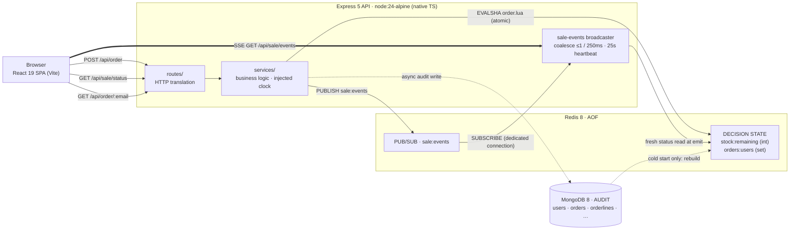

# Architecture

## 1. Purpose and invariants

The system sells a fixed number of units (default 100) to a large concurrent
audience within a bounded sale window. The implementation enforces three
invariants:

- **No oversell.** At most `STOCK_QUANTITY` orders are accepted.
- **Idempotent identity.** A buyer's email is the identity key. A repeat attempt
  returns the same success, never a duplicate and never a spurious error, at any
  time.
- **Fail closed.** When the authoritative store is unreachable, the system returns
  an error rather than a guess. A refusal is safe; a guess can oversell.

## 2. Topology



Three roles are kept strictly separate:

- **Redis is the decision layer.** It holds the only state a request reads or
  writes: remaining stock and the set of buyers. A single Lua script is the sole
  writer of that state while the API serves.
- **MongoDB is the audit layer.** It is written asynchronously after a decision
  and is never read on a request path. Its only runtime read is at cold start, to
  rebuild Redis.
- **The clock is the API server's `Date.now()`.** Client clocks are never
  consulted; the sale window is the server's UTC time alone.

## 3. Server layers

The server enforces a one-way dependency rule — `routes/ → services/ →
adapters/` — with business logic confined to `services/`. Routes translate HTTP;
adapters move data to and from stores; both hold zero business rules. Services are
framework-free: no `express`, `redis`, or `mongoose` imports.

### 3.1 Boot (`src/index.ts`, `src/bootstrap.ts`)

`index.ts` calls `bootstrap()`, then `listen()`. Any failure — invalid config,
unreachable store, a subscriber that will not connect — rejects `bootstrap()` and
exits non-zero before `listen()`. This is the boot-time form of failing closed.

`bootstrap()` is the single composition root, shared verbatim by the server and by
integration tests. Its order is fixed:

1. **Config** — parsed and validated first.
2. **Redis connect** — bounded timeout; node-redis would otherwise retry forever,
   so connect is raced against a timeout and the client is destroyed on failure.
3. **Mongo connect.**
4. **Lua script registration** — `SCRIPT LOAD` and SHA cache.
5. **Seed and reconcile** — idempotent seed upserts, then the warm/cold gate (§6).
6. **Sale-events layer** — publisher on the main connection, broadcaster, and
   subscriber on a dedicated duplicated connection; window-boundary timers for
   future boundaries only.
7. **App assembly.**

`bootstrap()` returns `teardown()`, which unwinds in reverse (timers, broadcaster,
subscriber, Mongo, Redis).

### 3.2 App assembly (`src/app.ts`)

The Express 5 pipeline: `helmet` → `pino-http` (one log line per request) → an
8 kb JSON body limit → the `/api` router → optional static SPA → an envelope 404 →
one central error middleware. Express 5 forwards rejected async handlers
automatically, so there is no per-route `try/catch`. Every error becomes a uniform
envelope, `{ success: false, error: string }`, with the status taken from the error
object. `RedisUnavailableError` carries status `503` and an `expose` flag so its
message is preserved.

### 3.3 Routes (`src/routes/`)

Four endpoints; the surface is closed.

| Method & path | Purpose |
| --- | --- |
| `GET /api/sale/status` | Sale status body: `status`, `stock`, window bounds. |
| `POST /api/order` | Atomic order attempt. |
| `GET /api/order/:email` | Membership read (idempotency / convenience). |
| `GET /api/sale/events` | SSE stream of `status` frames. |

The order route validates the email (trim; empty or greater than 256 characters is
a `400`) before invoking the service, so a `400` never reaches Redis. It then maps
the service outcome to the wire contract. The SSE route awaits the snapshot frame
before writing headers, so a Redis-down snapshot yields a clean `503` rather than a
half-open stream.

### 3.4 Services (`src/services/`)

- **`sale-status.ts`** — sole owner of the status state machine. Given the injected
  clock and a stock read, it computes `upcoming` / `active` / `ended` / `sold_out`
  over the window `[start, end)`: `active` inside the window with stock remaining,
  `sold_out` inside the window at zero. Stock is read in every state, so a Redis
  outage fails closed even outside the window. Both HTTP and SSE compose their
  bodies through this function.

- **`order.ts`** — owns response precedence. Outside the window, a single
  membership check yields `already` for an order holder, otherwise `inactive`.
  Inside the window, the decision is delegated to the Lua script and the verdict is
  mapped: `OK → created`, `ALREADY → already`, `SOLD_OUT → sold_out`. After an
  `OK` only, three side effects fire-and-forget: the Mongo audit write, the payment
  charge, and event publishes (`order.accepted` always; `sale.sold_out` once, from
  the request whose `DECR` reached zero). None is awaited, none affects the HTTP
  outcome, and none is rolled back — no compensating `INCR`/`SREM` exists.

- **`sale-events.ts`** — owns the realtime rules: a single serialized writer that
  composes each frame once through the status service (a fresh read at emit time);
  coalescing to at most one frame per 250 ms; terminal transitions (`sold_out`,
  `ended`) emitted immediately and guaranteed last; a snapshot on every reconnect
  (no replay, no `Last-Event-ID`); a 25 s heartbeat comment; and mid-stream fail
  closed — if truth cannot be read, every stream is closed. It also arms
  `sale.started` / `sale.ended` timers for future boundaries only; elapsed
  boundaries arm nothing, since snapshot-on-connect heals them.

- **`clock.ts`** — the injection seam: `systemClock = () => Date.now()`. Services
  take the clock injected; routes and adapters never call `Date.now()` for window
  decisions.

- **`payment.ts`** — defines a `PaymentProvider` port. The only v1 implementation
  is an instant-approve no-op. Payment sits behind acceptance and cannot fail an
  order.

### 3.5 Adapters (`src/adapters/`)

Adapters are narrow command surfaces over the stores, each bounded by a per-command
timeout so a hang becomes a failure.

**Redis (`adapters/redis/`)**

- **`order.lua`** — the authoritative decision. In one atomic, single-threaded
  unit it reads stock (erroring if the key is missing rather than fabricating a
  `0`), returns `ALREADY` if the email is a member, returns `SOLD_OUT` if stock is
  `≤ 0`, otherwise `SADD`s the email and `DECR`s stock, returning `OK` with the
  post-decrement remaining. While the API serves, this script is the only writer of
  `stock:remaining` and `orders:users`; there is no app-side lock.
- **`orders.ts`** — registers the script (`SCRIPT LOAD` + SHA cache) and invokes it
  by `EVALSHA`, with automatic `EVAL` fallback and re-cache on a `NOSCRIPT` reply.
  Exposes the single `SISMEMBER` used outside the window. Every reply is validated;
  an unparseable reply fails closed.
- **`stock.ts`** — reads `stock:remaining`; defines `RedisUnavailableError`
  (status `503`, `expose: true`) and the shared `bounded()` timeout wrapper. A
  missing key throws rather than returning a number.
- **`events.ts`** — the `sale:events` pub/sub layer. `PUBLISH` rides the main
  client; `SUBSCRIBE` runs on a dedicated duplicated connection. Payloads are
  type-only: the event string is the message, and consumers recompute truth from a
  fresh read.
- **`reconcile.ts`** — the boot rebuild. `hasStockKey()` is the warm/cold sentinel;
  `rebuild()` writes membership first and the stock sentinel last
  (`DEL → SADD → SET`), so a crash mid-rebuild re-runs the cold path on the next
  boot.
- **`client.ts`** — creates the node-redis client with offline queueing disabled
  and a bounded connect timeout.

**MongoDB (`adapters/mongo/`)**

- **`models.ts`** — the full v1 Mongoose schema: `User`, `Product`, `Sale`,
  `SaleProduct`, `Inventory`, `Order`, `OrderLine`, and a dormant `Reservation`
  that ships but is never written. Unique indexes guard `users.identifier`,
  `products.sku`, `(saleId, productId)`, and `(saleId, email)` on orders as
  defense-in-depth. `Inventory` is seeded once and never decremented per order;
  concurrency truth lives in Redis.
- **`audit.ts`** — the async writer, invoked only after an `OK`: upsert the user,
  insert a confirmed order, insert its order line. A duplicate-key error on
  `(saleId, email)` is swallowed as already-recorded.
- **`seed.ts`** — idempotent boot seed of the domain documents from env config;
  exposes `listConfirmedOrderEmails()`, the cold-rebuild source.
- **`client.ts`** — connection lifecycle only, with a 5 s server-selection timeout.

**Payment (`adapters/payment/noop.ts`)** — the instant-approve provider.

## 4. Request flows

### 4.1 `POST /api/order` inside the window

```
route validates email (400 on empty/oversized — Redis untouched)
  └─ order service: now ∈ [start, end)? yes
       └─ orders.attempt(email) → EVALSHA order.lua  (atomic)
            ├─ OK        → 201 "Order successful."
            │              async: audit write · payment charge
            │                     publish order.accepted (+ sale.sold_out if remaining == 0)
            ├─ ALREADY   → 200 "You have already ordered this item."
            └─ SOLD_OUT  → 409 "Item is sold out."
```

Outside the window the script never runs: a single `SISMEMBER` distinguishes an
order holder (`200`) from everyone else (`409 "Sale is not active."`). Precedence —
validation → already-ordered → window → stock → created — means an order holder
always wins, including a retry after the sale ends.

### 4.2 `GET /api/sale/events` (SSE)

The route awaits a fresh snapshot frame (failing closed with `503` if Redis is
down), sends SSE headers, writes the snapshot, and registers the connection.
Thereafter the broadcaster drives the stream: events on `sale:events` trigger a
coalesced, freshly composed `status` frame to every connection; a 25 s heartbeat
keeps intermediaries from closing idle streams; a lost subscriber connection closes
every stream, and a new stream receives a `503`.

### 4.3 Client realtime model (`client/src/hooks/useSaleStatus.ts`)

The client treats an open SSE stream as the sole writer of the status view. Polling
is a fallback whose writes are discarded while the stream is live. A `channel` axis
(`connecting` / `live` / `degraded` / `offline`) tracks liveness independently of
sale status, so the page never claims "live" over a frozen value. After every order
attempt the client re-syncs status once. `placeOrder` is total: a `409`, `503`,
dropped socket, or 10 s stall all resolve to a verdict, so no UI path strands a
spinner.

## 5. Data and state model

**Redis (runtime truth)**

- `stock:remaining` — integer unit count; also the warm/cold sentinel.
- `orders:users` — set of buyer emails holding a confirmed order.
- `sale:events` — pub/sub channel of type-only event strings.

Permitted writers of the two state keys are exactly three: the Lua script while
serving, the boot rebuild before `listen()`, and the offline reset script.

**MongoDB (durable audit)** — the domain documents in §3.5. It records outcomes;
it never decides them. Its only runtime read is the cold-start rebuild.

## 6. Restart safety: the warm/cold gate

On boot, after seeding, the reconciler checks whether `stock:remaining` exists.

- **Warm start (key present):** surviving Redis state is authoritative — nothing is
  touched. Consequently, changing `STOCK_QUANTITY` against surviving state is a
  no-op; a true reset occurs only via the offline reset script or
  `docker compose down -v`.
- **Cold start (key absent):** Redis is rebuilt from Mongo truth — list confirmed
  order emails, set `stock:remaining = STOCK_QUANTITY − count` (clamped at 0, with
  a warning if orders exceed stock), and repopulate `orders:users`. Redis is
  rebuilt from Mongo, never the reverse.

Because the rebuild writes the sentinel last, a crash mid-rebuild is safe: the next
boot sees no sentinel and re-runs the cold path.

## 7. Failure behavior

The system deliberately trades availability for correctness.

- **Redis unreachable or command timeout.** Any request needing Redis returns
  `503`; open SSE streams are closed and new ones refused. A command timeout counts
  as unreachable. There is no fallback store.
- **Crash between the Redis accept and the Mongo write.** The buyer keeps their
  order (Redis is correct; a retry returns `200`); the audit trail under-counts that
  row permanently. This is the accepted cost of an atomic, async decision path. The
  outbox pattern would close it; it is not implemented.
- **Side-effect failure (audit, payment, publish).** Logged and dropped; never
  rolled back, never able to change the HTTP outcome.
- **Script cache lost.** `attempt()` falls back to `EVAL` and re-caches the SHA.

Known gaps present in the code: no `SIGTERM`/`SIGINT` handling; no client-side
heartbeat watchdog; no email canonicalization beyond a trim (`a@x.com` ≠
`A@x.com`); and a Redis command timeout can `503` an order that committed
server-side (the idempotent retry recovers, but the first response was wrong).

## 8. Configuration

Configuration is environment variables only, parsed and validated once at boot
(`adapters/config.ts`), fail-fast; there is no runtime admin surface.
`SALE_START_TIME` and `SALE_END_TIME` are required ISO-8601 datetimes (end strictly
after start), parsed to UTC epoch ms once. `STOCK_QUANTITY` (default 100) and `PORT`
(default 3000) must be positive integers; `REDIS_URL` and `MONGODB_URI` default to
local. The Redis timeouts (2 s connect, 1 s per command) are fixed constants, not
tunables.

## 9. Testing and the stress proof

Tests follow the layering, across 33 test files in three workspaces. Unit tests
exercise services against fake adapters and an injected clock, with no I/O.
Integration tests boot through the same `bootstrap()` the server uses and drive the
app with supertest. The client is tested in jsdom with React Testing Library. Gates
are `npm test` (vitest) and a strict `tsc --noEmit` typecheck.

The `stress/` workspace is an independent observer: it imports no server code and
speaks only the wire and store contracts. `run.ts` orchestrates the protocol — stop
the API (a reset against a serving API would race the Lua script) → reset the stores
(guarded to refuse if anything answers) → start the API and wait for
`GET /api/sale/status` to return 200 → drive `ATTEMPTS` unique emails (default
5,000) at `POST /api/order` with k6, across `VUS` virtual users (default 500), with
thresholds failing on any 5xx or any status outside `{201, 409}` → verify against
Mongo and Redis by equality (confirmed orders == target == distinct emails ==
`SCARD orders:users`, and `stock:remaining == 0`) → restart with a past window and
confirm attempts are rejected `409`. Under-acceptance fails as loudly as oversell.
The combined exit code is the pass/fail signal.

## 10. Deployment

A multi-stage `Dockerfile` builds the client bundle, then runs the server on
`node:24-alpine` via native TypeScript type stripping — no server build step, no
bundler. `docker-compose.yml` runs the API alongside `redis:8-alpine` (AOF enabled)
and `mongo:8`, both health-gated, with an API healthcheck polling
`GET /api/sale/status` so dependents and the stress harness have a truthful
boot-complete signal. `docker compose up` serves SPA and API on port 3000. The
`Makefile` wraps the common flows (`make deploy`, `make stress`, `make clean`).

## 11. Trade-offs

- **One Lua script is the whole decision** — atomicity and a single writer, at the
  cost of core logic in Lua rather than TypeScript.
- **Redis decides, Mongo records** — single-source runtime reads, at the cost of
  the audit under-count window on a crash.
- **Fail closed on Redis loss** — correctness under partial failure, at the cost of
  availability.
- **Synchronous order flow, no queue** — immediate, interpretable verdicts, at the
  cost of any burst shock absorber.
- **Email as idempotency key** — honest retries, at the cost of canonicalization
  (case-sensitive today).
