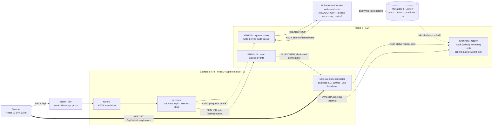
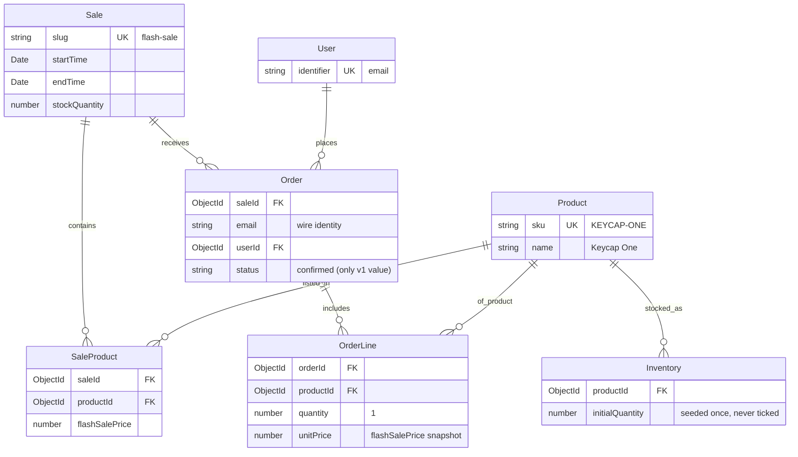

# Architecture

## 1. Purpose and invariants

The system sells a fixed number of units (configured in MongoDB) to a large
concurrent audience within a bounded sale window. The implementation enforces
three invariants:

- **No oversell.** At most `sale.stockQuantity` (provisioned in MongoDB) orders
  are accepted.
- **Idempotent identity.** A buyer's email is the identity key. A repeat attempt
  returns the same success, never a duplicate and never a spurious error, at any
  time.
- **Fail closed.** When the authoritative store is unreachable, the system returns
  an error rather than a guess. A refusal is safe; a guess can oversell.

## 2. Topology



Four roles are kept strictly separate:

- **Redis is the decision layer.** It holds the only state a request reads or
  writes: remaining stock and the set of buyers. A single Lua script is the sole
  writer of that state while the API serves.
- **The Redis Stream (`queue:orders`) is the write-behind queue.** After the Lua
  script returns `OK`, the route enqueues the order payload via `XADD` and
  returns HTTP 202 immediately. The worker drains the stream into MongoDB
  asynchronously, decoupling order-acceptance latency from MongoDB write latency.
- **MongoDB is the audit layer.** It is written by the background worker after it
  drains the queue, and is never read on a request path. Its only runtime read is
  at cold start, to rebuild Redis.
- **The clock is the API server's `Date.now()`.** Client clocks are never
  consulted; the sale window is the server's UTC time alone.

## 3. Server layers

The server enforces a one-way dependency rule — `routes/ → services/ →
adapters/` — with business logic confined to `services/`. Routes translate HTTP;
adapters move data to and from stores; both hold zero business rules. Services
are framework-free: no `express`, `redis`, or `mongoose` imports.

### 3.1 Boot (`src/index.ts`, `src/bootstrap.ts`)

`index.ts` calls `bootstrap()`, then `listen()`. Any failure — invalid config,
unreachable store, a subscriber that will not connect — rejects `bootstrap()` and
exits non-zero before `listen()`. This is the boot-time form of failing closed.

`bootstrap()` is the single composition root, shared verbatim by the server and
by integration tests. Its order is fixed:

1. **Config** — parsed and validated first (`loadConfig()`).
2. **Redis connect** — bounded timeout; node-redis would otherwise retry forever,
   so connect is raced against `redisConnectTimeoutMs × 5` and the client is
   destroyed on failure.
3. **Mongo connect.**
4. **Lua script registration** — `SCRIPT LOAD` and SHA cache; `attempt()` falls
   back to `EVAL` on a `NOSCRIPT` reply.
5. **DB reads** — `mongoSaleBootstrapOps.listAllSales()` reads all Sale documents
   from MongoDB (sale timing, stock quantity, and product pricing live in the
   database, provisioned beforehand by `db/scripts/seed-db.ts` — never upserted
   at server boot). `getSaleProduct(saleId)` fetches the active sale's product.
   Boot fails immediately if no sale is found or no product is configured.
6. **Multi-sale overlap validation** — fails boot if more than one sale's window
   overlaps `now()`; prevents ambiguous active-sale selection.
7. **Active sale selection** — selects the sale by priority: within-window first,
   then nearest upcoming, then most-recently-ended.
8. **Sale resolver** — middleware factory that resolves `:slug` URL params to a
   `SaleSummary` with a configurable in-memory cache TTL (default 60 s, max 60 s).
9. **Key migration** — one-time rename of v1.0 flat Redis keys (`stock:remaining`,
   `orders:users`) to v1.1 namespaced keys (`stock:{saleId}:remaining`,
   `orders:{saleId}:users`). No-op when flat keys are absent.
10. **Warm/cold reconciliation** — the restart gate (§6): warm start touches
    nothing; cold start rebuilds Redis from Mongo confirmed order emails.
11. **Sale-events layer** — publisher on the main connection, broadcaster, and
    subscriber on a dedicated duplicated connection; window-boundary timers for
    future boundaries only.
12. **App assembly.**

`bootstrap()` returns `teardown()`, which unwinds in reverse (timers, broadcaster,
subscriber, Mongo, Redis).

After `bootstrap()` resolves, `index.ts` checks `process.env.WORKER_COLOCATED`.
When set to `"true"`, it starts the write-behind worker in the same process
before calling `listen()`. Worker teardown (finishing the current batch) runs
before `teardown()` on SIGTERM/SIGINT. When `WORKER_COLOCATED` is unset or any
other value, the worker runs as a separate process (`src/worker/index.ts`) —
either as a standalone node invocation or the `worker` Docker Compose service.

### 3.2 App assembly (`src/app.ts`)

The Express 5 pipeline: `helmet` → `pino-http` (one log line per request) → an
`HTTP_BODY_LIMIT` JSON body limit (default 8 kb) → the `/api` router → optional
static SPA → an envelope 404 → one central error middleware. Express 5 forwards
rejected async handlers automatically, so there is no per-route `try/catch`.
Every error becomes a uniform envelope, `{ success: false, error: string }`, with
the status taken from the error object. `RedisUnavailableError` carries status
`503` and an `expose` flag so its message is preserved.

### 3.3 Routes (`src/routes/`)

Six endpoints form the complete API surface, all slug-scoped under
`/api/sales/:slug`.

The `:slug` parameter is resolved to a `SaleSummary` by the `SaleResolver`
middleware before each handler runs. An unknown slug yields `404`.

| Method & path | Purpose |
| --- | --- |
| `GET /api/sales/active` | Discover the active sale's slug. `404` if no sales exist. |
| `GET /api/sales/:slug` | Sale details with a product join, including live `remaining` stock. `remaining` is `null` when Redis is down — the one read path that degrades gracefully rather than failing closed. |
| `GET /api/sales/:slug/status` | Sale status body: `status`, `stock`, window bounds. |
| `POST /api/sales/:slug/order` | Atomic order attempt. |
| `GET /api/sales/:slug/order/:email` | Membership read (idempotency / convenience). |
| `GET /api/sales/:slug/events` | SSE stream of `status` frames. |

The order route validates the email (trim; empty, format-invalid, or greater
than 256 characters returns `400 "Email is required."`), then NFC-normalizes and
case-folds it before invoking the service, so a `400` never reaches Redis. The
SSE route registers the client and awaits the snapshot frame before writing
headers, so a Redis-down snapshot yields a clean `503` rather than a half-open
stream.

Full response set:

| Endpoint | Codes |
| --- | --- |
| `GET /api/sales/active` | `200 { slug }` · `404` no sales configured |
| `GET /api/sales/:slug` | `200` sale + products · `404` unknown slug |
| `POST /api/sales/:slug/order` | `202` accepted · `200` already ordered (outranks window/stock) · `409` sold out / sale not active · `400` invalid email · `503` Redis loss |
| `GET /api/sales/:slug/order/:email` | `200 { ordered: true｜false }` · `400` invalid email · `503` Redis loss |

### 3.4 Services (`src/services/`)

- **`sale-status.ts`** — sole owner of the status state machine. Given the
  injected clock and a stock read, it computes `upcoming` / `active` / `ended` /
  `sold_out` over the window `[start, end)`: `active` inside the window with
  stock remaining, `sold_out` inside the window at zero. Stock is read in every
  state, so a Redis outage fails closed even outside the window. Both HTTP and
  SSE compose their bodies through this function.

- **`order.ts`** — owns response precedence. Outside the window, a single
  membership check yields `already` for an order holder, otherwise `inactive`.
  Inside the window, the decision is delegated to the Lua script and the verdict
  is mapped: `OK → created`, `ALREADY → already`, `SOLD_OUT → sold_out`. After
  an `OK` only, three side effects fire-and-forget: the write-behind enqueue
  (`XADD` to `queue:orders`), the payment charge, and event publishes
  (`order.accepted` always; `sale.sold_out` once, from the request whose `DECR`
  reached zero). None is awaited, none affects the HTTP outcome, and none is
  rolled back — no compensating `INCR`/`SREM` exists.

- **`sale-events.ts`** — owns the realtime rules: a single serialized writer that
  composes each frame once through the status service (a fresh read at emit time);
  coalescing to at most one frame per 250 ms; terminal transitions (`sold_out`,
  `ended`) emitted immediately and guaranteed last; a snapshot on every reconnect
  (no replay, no `Last-Event-ID`); a 25 s named `heartbeat` event (observable by
  the client watchdog); and mid-stream fail closed — if truth cannot be read,
  every stream is closed. It also arms `sale.started` / `sale.ended` timers for
  future boundaries only; elapsed boundaries arm nothing, since
  snapshot-on-connect heals them.

- **`clock.ts`** — the injection seam: `systemClock = () => Date.now()`. Services
  take the clock injected; routes and adapters never call `Date.now()` for window
  decisions.

- **`payment.ts`** — defines a `PaymentProvider` port. The only v1 implementation
  is an instant-approve no-op. Payment sits behind acceptance and cannot fail an
  order.

### 3.5 Adapters (`src/adapters/`)

Adapters are narrow command surfaces over the stores, each bounded by a
per-command timeout so a hang becomes a failure.

**Redis (`adapters/redis/`)**

- **`order.lua`** — the authoritative decision. In one atomic, single-threaded
  unit it reads `stock:{saleId}:remaining` (erroring if the key is missing rather
  than fabricating a `0`), returns `ALREADY` if the email is a member of
  `orders:{saleId}:users`, returns `SOLD_OUT` if stock is `≤ 0`, otherwise `SADD`s
  the email and `DECR`s stock, returning `OK` with the post-decrement remaining.
  While the API serves, this script is the only writer of both keys; there is no
  app-side lock.
- **`orders.ts`** — registers the script (`SCRIPT LOAD` + SHA cache) and invokes
  it by `EVALSHA`, with automatic `EVAL` fallback and re-cache on a `NOSCRIPT`
  reply. Exposes the single `SISMEMBER` used outside the window. Every reply is
  validated; an unparseable reply fails closed. Exports `ordersKeyFor(saleId)`.
- **`stock.ts`** — reads `stock:{saleId}:remaining`; defines
  `RedisUnavailableError` (status `503`, `expose: true`) and the shared
  `bounded()` timeout wrapper. A missing key throws rather than returning a
  number. Exports `stockKeyFor(saleId)`.
- **`events.ts`** — the `sale:{saleId}:events` pub/sub layer. `PUBLISH` rides the
  main client; `SUBSCRIBE` runs on a dedicated duplicated connection. Payloads are
  type-only: the event string is the message, and consumers recompute truth from a
  fresh read.
- **`order-queue.ts`** — the write-behind Redis Stream producer and consumer.
  `createOrderQueueProducer` exposes
  `enqueue(saleId, productId, email, flashSalePrice)` which `XADD`s a JSON
  payload to `queue:orders` and returns a UUID correlation id.
  `createQueueAuditAdapter` wraps the producer as an `OrderAuditPort` drop-in for
  bootstrap. `createOrderQueueConsumer` is used exclusively by the worker: it
  exposes `ensureGroup()` (idempotent `XGROUP CREATE`), `readPending()` (`id="0"`,
  re-delivers unACKed PEL entries), `readBatch()` (`id=">"`, new messages, with
  `BLOCK`), and `ack()` (`XACK` after confirmed MongoDB write). Every iteration of
  the worker loop calls `readPending()` first; only when the PEL is empty does it
  call `readBatch()`, ensuring failed batches are retried without skipping entries.
- **`reconcile.ts`** — the boot rebuild. `hasStockKey(saleId)` is the warm/cold
  sentinel; `rebuild(emails, remaining, saleId)` writes membership first and the
  stock sentinel last (`DEL → SADD → SET`), so a crash mid-rebuild re-runs the
  cold path on the next boot.
- **`migrate.ts`** — one-time v1.0 → v1.1 flat-key migration. Renames
  `stock:remaining` → `stock:{saleId}:remaining` and `orders:users` →
  `orders:{saleId}:users` when the flat keys are present. No-op on a fresh install
  or after the migration has already run. Invoked at boot before reconciliation
  (§3.1 step 9).
- **`client.ts`** — creates the node-redis client with offline queueing disabled
  and a bounded connect timeout.

**MongoDB (`adapters/mongo/`)**

- **`models.ts`** — the v1 Mongoose schema: `User`, `Product`, `Sale`,
  `SaleProduct`, `Inventory`, `Order`, `OrderLine`. Unique indexes guard
  `users.identifier`, `products.sku`, `(saleId, productId)` on saleproducts, and
  `(saleId, email)` on orders as defense-in-depth. `Inventory` is seeded once and
  never decremented per order; concurrency truth lives in Redis.
- **`audit.ts`** — the single-order async writer (used by tests that need
  immediate Mongo writes via `BootstrapOverrides.createOrderAudit`). Not on the
  production hot path; the queue adapter is the default.
- **`bulk-audit.ts`** — the worker's write surface. `mongoBulkAudit.bulkRecordOrders`
  receives a batch of `QueueOrderPayload` entries and writes them to MongoDB in
  five idempotent phases: (1) bulk upsert Users, (2) resolve User `_id`s, (3)
  bulk upsert Orders, (4) resolve Order `_id`s, (5) bulk upsert OrderLines. All
  three `bulkWrite` calls use `ordered: false` so a duplicate-key skip does not
  abort the rest of the batch. Safe under at-least-once re-delivery.
- **`seed.ts`** — exported string/number constants only (`SALE_SLUG`,
  `PRODUCT_SKU`, `PRODUCT_NAME`, etc.). The boot-time upsert path was removed
  when sale and product data was migrated to MongoDB; the constants remain so
  tests and the standalone seed script can import them as fixtures without
  hardcoding strings.
- **`sale-bootstrap.ts`** — the three boot-time read operations: `listAllSales()`
  (used for active-sale selection and the multi-sale overlap guard),
  `getSaleProduct(saleId)` (fetches the active sale's product and flash-sale
  price), and `listConfirmedOrderEmails(saleId)` (the cold-rebuild source). None
  of these write to MongoDB.
- **`catalog.ts`** — `createCatalogReader`. Joins `SaleProduct` → `Product` and
  `Inventory` to produce the product list for `GET /api/sales/:slug`. The live
  `remaining` value comes from a separate Redis read; a missing or unavailable
  Redis value resolves to `null` rather than failing the whole response.
- **`client.ts`** — connection lifecycle only, with a configurable
  server-selection timeout.

**Payment (`adapters/payment/noop.ts`)** — the instant-approve provider.

### 3.6 Write-behind worker (`src/worker/`)

The worker is a standalone process that drains `queue:orders` into MongoDB. It
runs separately from the API by default and can also run co-located (§3.1).

- **`order-worker.ts`** — polling loop using XREADGROUP with consumer group
  `WORKER_GROUP` (default `"workers"`) and consumer ID `WORKER_CONSUMER_ID`
  (default `worker-<hostname>`). Each replica must use a distinct consumer ID so
  PEL re-delivery is scoped per-instance. Every iteration calls `readPending()`
  (`id="0"`, re-delivers unACKed PEL entries) first, then `readBatch()`
  (`id=">"`, new messages, with `BLOCK`) only when the PEL is empty. This ensures
  failed batches are retried after a MongoDB outage without losing messages.
  `XACK` fires only after `bulkRecordOrders` confirms. Exponential backoff: 500 ms
  initial, 30 s cap.
- **`index.ts`** — standalone entrypoint; connects Redis + MongoDB, starts worker,
  handles SIGTERM/SIGINT with ordered teardown (worker stop → disconnectMongo →
  redis.close). Calls `loadWorkerConfig()` (not `loadConfig()`), so sale-window
  env vars are not needed for the worker process — only `REDIS_URL`, `MONGODB_URI`,
  and the optional `WORKER_CONSUMER_ID` / `WORKER_GROUP` overrides.

## 4. Request flows

### 4.1 `POST /api/sales/:slug/order` inside the window

```
route validates email (400 on invalid — Redis untouched)
  └─ order service: now ∈ [start, end)? yes
       └─ orders.attempt(email) → EVALSHA order.lua  (atomic)
            ├─ OK        → 202 "Order accepted."
            │              async fire-and-forget:
            │                XADD queue:orders  (write-behind enqueue)
            │                payment charge
            │                PUBLISH order.accepted (+ sale.sold_out if remaining == 0)
            ├─ ALREADY   → 200 "You have already ordered this item."
            └─ SOLD_OUT  → 409 "Item is sold out."

  [background] worker: XREADGROUP queue:orders
       └─ bulkRecordOrders → MongoDB (User · Order · OrderLine)
       └─ XACK (only after confirmed write)
```

Outside the window the script never runs: a single `SISMEMBER` distinguishes an
order holder (`200`) from everyone else (`409 "Sale is not active."`). Precedence
— validation → already-ordered → window → stock → created — means an order holder
always wins, including a retry after the sale ends.

### 4.2 `GET /api/sales/:slug/events` (SSE)

The route registers the client sink before composing the snapshot (so any domain
event that arrives during the await is buffered and flushed after the snapshot
lands), then awaits a fresh snapshot frame (failing closed with `503` if Redis is
down), sends SSE headers, and writes the snapshot. Thereafter the broadcaster
drives the stream: events on `sale:{saleId}:events` trigger a coalesced, freshly
composed `status` frame to every connection; a 25 s heartbeat keeps intermediaries
from closing idle streams; a lost subscriber connection closes every stream, and
a new stream receives a `503`.

### 4.3 Client realtime model

The browser SPA is a React 19 app with three routes: `/` redirects to
`/sale/:slug` via `useActiveSaleRedirect` (which calls `GET /api/sales/active`);
`/sale/:slug` is the main sale page; and `*` is a 404 page. All client API
functions (`fetchSaleStatus`, `fetchSaleDetails`, `placeOrder`, `checkOrder`,
`saleEventsUrl`) are slug-parameterized and call the `/api/sales/:slug/…` paths
exclusively. The SPA is served by nginx (port 80); nginx proxies `/api/` requests
to the API server (port 3000) on the same Docker network.

`useSaleStatus(slug)` treats an open SSE stream as the sole writer of the status
view. Polling is a fallback whose writes are discarded while the stream is live.
A `channel` axis (`connecting` / `live` / `degraded` / `offline`) tracks liveness
independently of sale status, so the page never claims "live" over a frozen value.
A `notFound` flag is set on a `404` response from the slug lookup and is terminal
— polling and reconnects stop. After every order attempt the client re-syncs
status once. `placeOrder` is total: a `409`, `503`, dropped socket, or 10 s stall
all resolve to a verdict, so no UI path strands a spinner.

## 5. Data and state model

### 5.1 Domain model

Seven Mongoose collections ship in v1 (`users`, `products`, `sales`,
`saleproducts`, `inventories`, `orders`, `orderlines`). Behavior is
trigger-gated — some entities are boot-seeded constants, some are written per
order.



**Lifecycle categories:**

| Category | Collections | Behavior |
| --- | --- | --- |
| Boot-seeded constants | `products`, `sales`, `saleproducts`, `inventories` | Provisioned by `db/scripts/seed-db.ts` (run once before first server start, idempotent). The server reads (never writes) these at boot via `mongoSaleBootstrapOps` (`sale-bootstrap.ts`). `Inventory.initialQuantity` is set on first seed (`$setOnInsert`) and is never decremented — concurrency truth lives in Redis. |
| Per-order writes | `users`, `orders`, `orderlines` | Written by the background worker after draining `queue:orders` (§3.6). `Order` has a compound unique index on `(saleId, email)` as defense-in-depth. `OrderLine.unitPrice` carries the `flashSalePrice` snapshot from the queue payload — unaffected by later price changes. |

All schemas use `timestamps: true`. Unique indexes guard `users.identifier`,
`products.sku`, `saleproducts(saleId, productId)`, and `orders(saleId, email)`.

### 5.2 Redis state (runtime truth)

Keys are namespaced by the MongoDB `ObjectId` of the active sale document
(`{saleId}`), so multiple sales can coexist in the same Redis instance.

- `stock:{saleId}:remaining` — integer unit count; also the warm/cold sentinel.
- `orders:{saleId}:users` — set of buyer emails holding a confirmed order.
- `sale:{saleId}:events` — pub/sub channel of type-only event strings.
- `queue:orders` — Redis Stream; the write-behind audit queue. Consumer group
  `workers` (default; configurable via `WORKER_GROUP`) reads it; entries remain
  in the PEL until `XACK` confirms MongoDB receipt. Not namespaced by `saleId` —
  the payload carries `saleId`.

Permitted writers of the two state keys (`stock:*`, `orders:*`) are exactly
three: the Lua script while serving, the boot rebuild before `listen()`, and the
offline reset script.

### 5.3 Key interfaces

| Type | Location | Purpose |
| --- | --- | --- |
| `AppConfig` | `adapters/config.ts` | Boot-parsed env for the API process: `port`, `redisUrl`, `mongodbUri`, `redisConnectTimeoutMs`, `redisCommandTimeoutMs`, `redisReconnectMaxMs`, `mongoSelectionTimeoutMs`, `httpBodyLimit`, `saleResolverCacheTtlMs`. Sale timing, stock, and product pricing are **not** in `AppConfig` — they are read from MongoDB at boot. `WORKER_COLOCATED` is also not part of `AppConfig`; it is read directly from `process.env` in `src/index.ts`. |
| `WorkerConfig` | `adapters/config.ts` | Minimal config for the standalone worker: `redisUrl`, `mongodbUri`, Redis timeouts, `workerConsumerId` (defaults to `worker-<hostname>`; must be unique per replica), `workerGroup` (defaults to `"workers"`). Sale-window vars not needed. |
| `OrderVerdict` | `adapters/redis/orders.ts` | `"OK" \| "ALREADY" \| "SOLD_OUT"` — the Lua script's three outcomes. |
| `SaleStatus` | `services/sale-status.ts` | `"upcoming" \| "active" \| "ended" \| "sold_out"` — the four lifecycle states. |
| `OrderOutcome` | `services/order.ts` | `created \| already \| sold_out \| inactive` — the service-level verdicts mapped to HTTP. |
| `PaymentProvider` | `services/payment.ts` | Charge port; `noop.ts` is the sole v1 impl (instant-approve, cannot fail). |
| `Clock` | `services/clock.ts` | `() => number` — injected into services so routes/adapters never call `Date.now()`. |
| `SaleSummary` | `middleware/sale-resolver.ts` | Boot-resolved sale context: `{ _id, slug, name?, startTime, endTime, stockQuantity }`. Attached to `req.sale` by the `SaleResolver` middleware; passed to service calls as `saleId` and window bounds. |
| `QueueOrderPayload` | `adapters/redis/order-queue.ts` | `{ orderId, saleId, productId, email, enqueuedAt, flashSalePrice }` — the stream entry payload. `orderId` is a UUID correlation id, not the Mongo PK. `flashSalePrice` is a price snapshot carried so the worker can persist it without a second Mongo lookup. |
| `BulkAuditPort` | `adapters/mongo/bulk-audit.ts` | `bulkRecordOrders(payloads)` — the worker's MongoDB write surface. |
| `SaleNotFoundError` | `client/src/api/sale.ts` | Thrown on a `404` from `GET /api/sales/:slug`. Signals `useSaleStatus` to set `notFound: true` and stop all reconnect attempts. |

**MongoDB (durable audit)** — the domain documents above. It records outcomes;
it never decides them. Its only runtime read is the cold-start rebuild.

## 6. Restart safety: the warm/cold gate

On boot, after the active sale is selected and key migration runs, the reconciler
checks whether `stock:{saleId}:remaining` exists.

- **Warm start (key present):** surviving Redis state is authoritative — nothing
  is touched. Consequently, editing `sale.stockQuantity` in MongoDB against
  surviving Redis state is a no-op; a true reset occurs only via the offline reset
  script or `docker compose down -v`.
- **Cold start (key absent):** Redis is rebuilt from Mongo truth — list confirmed
  order emails, set `stock:{saleId}:remaining = sale.stockQuantity − count`
  (clamped at 0, with a warning if orders exceed stock), and repopulate
  `orders:{saleId}:users`. Redis is rebuilt from Mongo, never the reverse.

Because the rebuild writes the sentinel last, a crash mid-rebuild is safe: the
next boot sees no sentinel and re-runs the cold path.

Note: `queue:orders` entries that have not yet been drained (PEL entries in the
worker's consumer group) survive across API restarts because the stream key
persists in Redis. A cold-start rebuild queries Mongo for confirmed order emails,
which only includes entries already written by the worker — so any in-flight PEL
entries are correctly excluded from the rebuild count and will be ACKed once the
worker restarts and processes them.

## 7. Failure behavior

The system deliberately trades availability for correctness.

- **Redis unreachable or command timeout.** Any request needing Redis returns
  `503`; open SSE streams are closed and new ones refused. A command timeout
  counts as unreachable. There is no fallback store.
- **Crash between the Redis accept and the XADD.** The buyer keeps their order
  (Redis is correct; a retry returns `200`); the order is never enqueued and the
  audit trail under-counts that row permanently. This is the accepted cost of the
  fire-and-forget enqueue path. It is the sole remaining under-count scenario;
  once an entry reaches `queue:orders`, at-least-once delivery guarantees eventual
  MongoDB persistence.
- **Worker MongoDB write failure.** The batch is not ACKed — entries remain in
  the PEL. The worker backs off exponentially (500 ms → 30 s cap) and retries on
  the next iteration via `readPending()`. No audit data is lost; the write
  eventually succeeds when MongoDB recovers. `bulkRecordOrders` is idempotent
  (unique-index upserts), so re-delivery is safe.
- **Worker process crash.** PEL entries persist in the Redis Stream. When the
  worker restarts, `readPending()` re-delivers them before reading new entries.
  No messages are skipped or lost.
- **Side-effect failure (payment, publish).** Logged and dropped; never rolled
  back, never able to change the HTTP outcome.
- **Script cache lost.** `attempt()` falls back to `EVAL` and re-caches the SHA.

Known gap: a Redis command timeout can `503` an order that committed server-side
(the idempotent retry recovers, but the first response was wrong). Previously-
listed gaps are now closed: `SIGTERM`/`SIGINT` are handled for a clean drain; the
client runs a heartbeat/silence watchdog over the stream; and the order key is
canonicalized (NFC-normalized and case-folded) so `A@x.com` and `a@x.com`
collapse to one identity.

- **`make deploy` against a running stack silently ignores `stockQuantity` changes.**
  `make deploy` re-seeds MongoDB (updating `sale.stockQuantity`) and recreates the
  API container, but leaves Redis running. At the boot reconcile step (§6), the
  warm-start branch is taken because `stock:{saleId}:remaining` survives — the new
  `stockQuantity` is never applied to Redis. The update is durable in MongoDB but
  has no effect on the live counter. This is the intended behavior of the warm/cold
  gate, not a bug, but it can silently surprise operators. The only way to apply the
  change is to flush the Redis sentinel key before restarting (`docker compose down
  -v` or the stress harness's offline reset), which forces a cold rebuild from
  MongoDB. A runtime admin endpoint (§11.9) would close this gap without a flush.

## 8. Configuration

Configuration is environment variables only, parsed and validated once at boot
(`adapters/config.ts`), fail-fast before `listen()`; there is no runtime admin
surface.

**Sale timing, stock quantity, and product pricing are not environment variables.**
They are stored in MongoDB and provisioned via `db/scripts/seed-db.ts` before the
first server start. The API reads these at boot via `mongoSaleBootstrapOps`
(`adapters/mongo/sale-bootstrap.ts`) and fails fast if no sale or product is
found.

**API server (`AppConfig` via `loadConfig()`):**

| Variable | Default | Constraint |
| --- | --- | --- |
| `REDIS_URL` | `redis://localhost:6379` | Redis 8, AOF enabled |
| `MONGODB_URI` | `mongodb://localhost:27017/flash-sale` | Audit database and sale config |
| `PORT` | `3000` | Positive integer ≤ 65535 |
| `REDIS_CONNECT_TIMEOUT_MS` | `2000` | Positive integer; boot connect timeout. Increase for TLS/Atlas/cluster. |
| `REDIS_COMMAND_TIMEOUT_MS` | `1000` | Positive integer; per-command timeout. A timeout is treated as unreachable (503). |
| `REDIS_RECONNECT_MAX_MS` | `2000` | Positive integer; reconnect backoff ceiling. Raise if Redis failover exceeds 2 s. |
| `MONGO_SELECTION_TIMEOUT_MS` | `5000` | Positive integer; server-selection timeout. Atlas replica-set elections can exceed 5 s. |
| `HTTP_BODY_LIMIT` | `8kb` | Express JSON body size limit. |
| `SALE_RESOLVER_CACHE_TTL_MS` | `60000` | Positive integer ≤ 60 000; slug→sale in-memory cache TTL in ms. |

> `WORKER_COLOCATED` is not part of `AppConfig` and is not validated by
> `loadConfig()`. It is read directly from `process.env` in `src/index.ts`:
> `"true"` starts the worker co-located; any other value (or unset) leaves the
> worker as a separate process.

**Standalone write-behind worker (`WorkerConfig` via `loadWorkerConfig()`):**

| Variable | Default | Notes |
| --- | --- | --- |
| `REDIS_URL` | `redis://localhost:6379` | Same as API |
| `MONGODB_URI` | `mongodb://localhost:27017/flash-sale` | Same as API |
| `REDIS_CONNECT_TIMEOUT_MS` | `2000` | Same semantics as API |
| `REDIS_COMMAND_TIMEOUT_MS` | `1000` | Same semantics as API |
| `REDIS_RECONNECT_MAX_MS` | `2000` | Same semantics as API |
| `WORKER_CONSUMER_ID` | `worker-<hostname>` | Unique XREADGROUP consumer name per replica. Each pod must use a distinct value so PEL re-delivery is scoped per-instance. |
| `WORKER_GROUP` | `workers` | Consumer group name shared by all workers draining the same stream. |

The worker reads only `REDIS_URL`, `MONGODB_URI`, the Redis timeouts, and the
worker identity vars via `loadWorkerConfig()` — sale-window env vars are not
needed for the worker process.

## 9. Testing and the stress proof

Tests follow the layering across three workspaces. Unit tests exercise services
against fake adapters and an injected clock, with no I/O. Integration tests boot
through the same `bootstrap()` the server uses and drive the app with supertest.
The client is tested in jsdom with React Testing Library. Gates are `npm test`
(vitest) and a strict `tsc --noEmit` typecheck.

Tests that need immediate MongoDB writes (audit and cold-restart tests) use
`BootstrapOverrides.createOrderAudit` to inject `createOrderRecorder` directly,
bypassing the write-behind queue. The default bootstrap wires
`createQueueAuditAdapter` (the stream producer); tests relying on the default do
not write to MongoDB on the request path by design.

The `stress/` workspace is an independent observer: it imports no server code and
speaks only the wire and store contracts. `run.ts` orchestrates the protocol:

1. **Stop** the API (a reset against a serving API would race the Lua script).
2. **Reset** the stores — offline wipe of Redis and MongoDB order state, guarded
   to refuse if anything answers.
3. **Start** the API and wait for it to become healthy.
4. **Burst** — drive `ATTEMPTS` unique emails (default 5,000) at
   `POST /api/sales/:slug/order` with k6 across `VUS` virtual users (default 500).
   k6 thresholds fail on any 5xx or any status outside `{202, 409}`.
5. **Verify** — check Redis (`SCARD orders:{saleId}:users == STOCK_QUANTITY`,
   `stock:{saleId}:remaining == 0`) and Mongo (confirmed order count). An
   under-count in Mongo passes with a note (accepted audit gap); an over-count
   hard-fails; any under-acceptance fails as loudly as oversell.
6. **Window phase** — set a past sale window in MongoDB, restart the API, confirm
   all attempts are rejected `409 "Sale is not active."`, then restore the
   original window.

The combined exit code is the pass/fail signal.

## 10. Deployment

Two separate Dockerfiles build independent images:

- **`Dockerfile.server`** — `node:24-alpine`. Installs only server workspace
  dependencies, copies `server/src`, and runs `node src/index.ts` via native
  TypeScript type stripping — no server build step, no bundler. The same image is
  used for both the `api` service and the `worker` service (differentiated by the
  Compose `command` override).
- **`Dockerfile.client`** — multi-stage: `node:24-alpine` runs `npm run build -w
  client` (Vite), then the bundle is copied into `nginx:alpine`. `nginx.conf`
  serves the SPA at `/` and reverse-proxies `/api/` to the API container, with
  `proxy_buffering off` for SSE streams.

`docker-compose.yml` runs five services:

| Service | Image | Port | Profile |
| --- | --- | --- | --- |
| `api` | `Dockerfile.server` | 3000 | (always) |
| `worker` | `Dockerfile.server` | — | `worker` |
| `client` | `Dockerfile.client` | 80 | (always) |
| `redis` | `redis:8-alpine` (AOF) | 127.0.0.1:6379 | (always) |
| `mongo` | `mongo:8` | 127.0.0.1:27017 | (always) |

The `worker` service is gated behind the `worker` Compose profile so it does not
start on a plain `docker compose up`. `make deploy` activates `--profile worker`
by default; set `WORKER_COLOCATED=true` to omit the profile and run the worker
inside the API process instead. The `Makefile` wraps the common flows (`make
deploy`, `make stress`, `make clean`, `make worker-logs`).

In development, Vite serves the SPA separately on `:5173` (with `/api` proxied);
`npm run dev` starts the API server, the write-behind worker, and Vite
concurrently.

## 11. Trade-offs

Every choice below buys one of the §1 invariants at a real, named cost. They are
recorded here in full so a future maintainer inherits the reasoning, not just the
result. Each entry states the decision, why it was made, what it costs, the
alternatives that were weighed, and the condition under which it should be
revisited.

### 11.1 One Lua script is the whole decision

**Decision.** The membership check, stock check, `SADD`, and `DECR` live in a
single `order.lua` script (`§3.5`), executed by Redis as one indivisible unit.
While the API serves traffic, that script is the *only* writer of
`stock:{saleId}:remaining` and `orders:{saleId}:users`.

**Why.** Redis runs scripts single-threaded, so the four steps cannot interleave
with another request. This is what makes "no oversell" and "one item per user"
true by construction rather than by hope — there is no read-modify-write window
for a concurrent buyer to slip through, and no distributed lock to acquire,
renew, or leak.

**Cost.** The most correctness-critical logic in the system is written in Lua,
not the TypeScript the rest of the codebase uses. It is harder to unit-test in
isolation, has no type checker, and is a context switch for a reviewer. We
contain the cost by keeping the script tiny and testing its observable semantics
through the order-store and endpoint suites.

**Alternatives considered.** (a) A `WATCH`/`MULTI` optimistic transaction —
rejected: retries under contention add latency exactly when load is highest, and
the retry loop is itself easy to get wrong. (b) A distributed lock (Redlock) —
rejected: heavier, adds failure modes (clock skew, lock expiry), and still needs
the same atomic body. (c) A relational row lock — rejected: pushes the hot path
into a disk-backed store.

**Revisit when.** The decision needs more than a set and a counter — e.g.
per-tier stock, multiple SKUs, or fraud scoring.

### 11.2 Redis decides, write-behind worker records

**Decision.** Redis holds the only state a request reads or writes. After the Lua
script returns `OK`, the route `XADD`s the order to `queue:orders` and returns
`202 Accepted` to the caller. A background worker (`§3.6`) drains the stream to
MongoDB via `XREADGROUP` / `XACK`, with at-least-once delivery and exponential
backoff.

**Why.** The request path touches exactly one in-memory store and returns. The
durable, queryable history the business wants (who ordered, when, payment
references) is kept out of the latency budget entirely. The Redis Stream's
at-least-once delivery model (`XACK` only after MongoDB confirms) closes the gap
that a plain fire-and-forget async write would leave open.

**Cost.** A crash in the tiny window between "Lua script returns OK" and "XADD
fires" loses the audit row permanently — an audit *under*-count. There is
intentionally **no** compensating `INCR`/`SREM` anywhere (`§7`). The accepted
residual risk is the sub-millisecond EVALSHA → XADD gap.

**Alternatives considered.** (a) Synchronous Mongo write before the 202 —
rejected: puts a disk-backed store on the hot path. (b) A single store for both
roles — rejected: no one store is both the ideal concurrency primitive and the
ideal audit database. (c) The Lua script also enqueuing — deferred: would push
JSON serialization into the Lua layer.

**Revisit when.** The audit under-count becomes unacceptable (e.g. finance needs
an exact ledger). The fix is to move the enqueue into the Lua script itself.

### 11.3 Fail closed on Redis loss

**Decision.** When Redis is unreachable or a command times out, the request
returns `503` rather than a guess (`§7`). Bounded connect and per-command
timeouts turn a hang into a fast, typed `RedisUnavailableError`.

**Why.** A refusal is always safe, a guess can oversell. Fabricating a stock
number would lie "sold out" or oversell. Neither is acceptable.

**Cost.** Availability is sacrificed to correctness. If Redis is down, the sale
is down. For a flash sale, where an oversell is a customer-facing failure and a
brief outage is not, this is the right side of the trade.

**Revisit when.** A read replica or Redis Cluster is introduced; the fail-closed
rule stays, but reads can then survive a primary blip.

### 11.4 Synchronous order decision, no decision queue

**Decision.** A purchase decision is made inline and answered on the same
request. There is no message queue absorbing the burst ahead of the *decision* —
the write-behind queue is for the audit trail, not for the order verdict.

**Why.** The buyer gets an immediate, interpretable verdict — `created`, `already`,
`sold_out`, `inactive` — with no "your request is being processed" limbo. Because
the atomic script is O(1) and in-memory, a queue would add latency without buying
correctness.

**Cost.** There is no shock absorber for the decision path. The API tier must be
scaled to meet peak concurrency head-on.

**Revisit when.** The decision stops being O(1) and cheap, or the API tier cannot
be scaled wide enough to meet peak concurrency.

### 11.5 Email as the idempotency key

**Decision.** A buyer's email is their identity. `orders:{saleId}:users` is a set
of emails; a repeat attempt is recognized by set membership (`§4.1`).

**Why.** It satisfies the idempotent-identity invariant with the identifier the
buyer already supplies — no session, no account system, no server-issued token.

**Cost.** Identity is only as good as the string. NFC-normalization and
case-folding collapse `A@x.com` and `a@x.com` to one identity; provider-specific
aliasing (Gmail dots, `+tags`) is an accepted, documented bypass.

**Revisit when.** The sale is real. Fold provider aliases, and back identity with
an authenticated account id rather than a raw email.

### 11.6 Scale by widening a stateless tier

**Decision.** The API is stateless, so throughput scales by running more identical
instances behind a load balancer, all pointed at the same Redis and Mongo.

**Why.** State lives in Redis, not the process, so any instance can serve any
request. The concurrency guarantee does not weaken as the tier widens.

**Cost.** Redis becomes the shared throughput ceiling: every accepted order is one
round-trip to one Redis primary.

**Revisit when.** One Redis primary is genuinely the ceiling. Options then: a
read replica to offload status reads, then Redis Cluster with per-node
sub-inventories.

### 11.7 SSE over Redis pub/sub for realtime status

**Decision.** Live status reaches the browser over Server-Sent Events, fed by a
broadcaster subscribed to a Redis pub/sub channel (`§3.4`, `§4.2`), with the
client falling back to polling when the stream drops (`§4.3`).

**Why.** Status is one-directional server→client, which is exactly SSE's shape —
plain HTTP, auto-reconnect semantics, no second protocol. The broadcaster
coalesces bursts (≤1 per 250 ms), so a sell-out spike does not become a
per-order fan-out storm.

**Cost.** SSE is one-way and carries an idle connection per viewer; the
broadcaster is a stateful component the stateless API tier otherwise avoids.

**Revisit when.** The channel needs client→server messaging, or per-viewer
connection cost dominates at very high concurrent-viewer counts.

### 11.8 Native TypeScript, no build step

**Decision.** The server runs TypeScript directly on Node 24's native type
stripping — no bundler, no transpile step, no emitted `dist/`.

**Why.** One fewer moving part: the code that runs is the code on disk, so a boot
is `node src/index.ts`, and a stack trace points at a real line. `tsc --noEmit`
still guards types; the runtime simply does not need a build.

**Cost.** It pins the server to a Node version new enough to strip types, and
forgoes the dead-code elimination a bundler gives. The client still builds (Vite)
because the browser needs a bundle; only the server skips it.

**Revisit when.** The server must run on a Node older than the type-stripping
baseline, or needs bundling for size/startup.

### 11.9 No live reconfiguration path for stock

**Decision.** Sale config (stock quantity, time window) is locked into process
state at `bootstrap()`. Updating `db/data/sales.json` and running `make deploy`
writes new values to MongoDB via the idempotent seeder, but the API's warm restart
ignores the stock change because `stock:{saleId}:remaining` survives in Redis (§6).

**Why.** The warm-start gate treats Redis as authoritative over MongoDB for the
running stock count — this is intentional restart-safety behavior. Applying a
`stockQuantity` change mid-sale would require a privileged write to both MongoDB
and the live Redis key in a single atomic operation, which implies an operator admin
surface that was out of scope for v1.

**Cost.** Operators who update `sales.json` and redeploy expecting an immediate
stock change are silently wrong. The only reliable reset path is `docker compose
down -v` (flushes Redis) or the stress harness's offline reset step, both of which
require downtime.

**Revisit when.** A `PATCH /admin/sales/:id` endpoint is added. It must atomically
update both `sale.stockQuantity` in MongoDB and `stock:{saleId}:remaining` in Redis
— and should only decrease stock (not increase beyond the original seeded total
without an audit-consistent journal entry). The existing `SaleBootstrapOps` and
`StockStore` interfaces provide the seams; the missing piece is the write endpoint
and operator auth.
